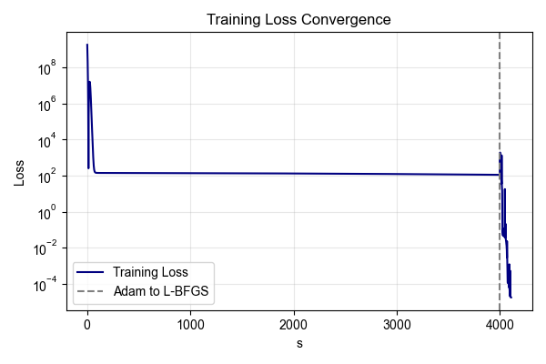
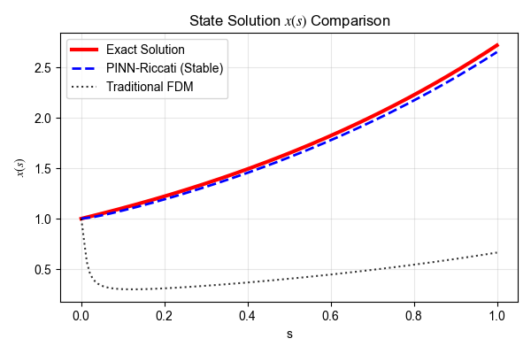
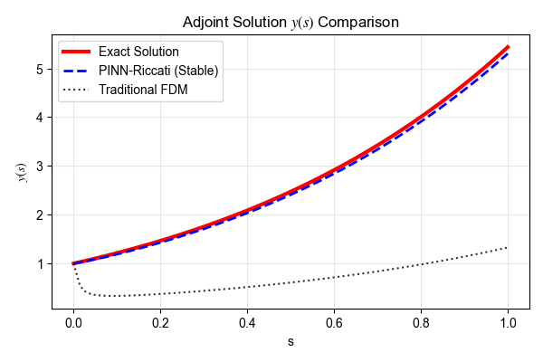
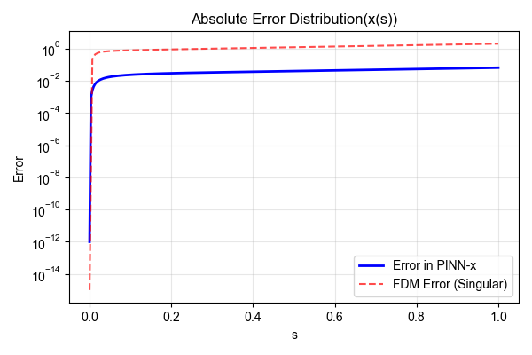
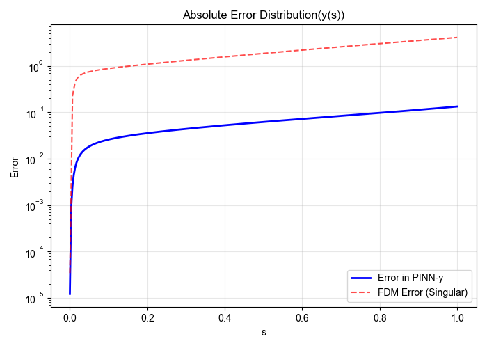

::: {.abstract}
**摘要**：奇异两点边值问题广泛存在于时间不一致控制与复杂动态博弈等前沿领域中，这类问题的特点是：在时间端点附近，方程的系数可能会变得非常大甚至无界。这就导致传统的Lipschitz连续性条件不再成立，使得我们很难用常规方法去判断解存在唯一性。本文主要研究一类状态变量和伴随变量紧密耦合的奇异两点边值问题，重点讨论它的解在什么条件下存在且唯一。

由于奇异性会导致传统的Picard迭代和打靶法失效，本文引入Riccati-Lyapunov方程，将原本耦合的双端约束系统进行解耦。通过代数推导，本文证明了一个充要条件：该奇异两点边值问题存在唯一解，当且仅当对应的Riccati-Lyapunov方程存在唯一的对称正定解。

进一步，针对奇异性导致压缩映射条件不成立的问题，本文在函数空间中选取一个固定半径的闭球，利用Banach压缩映射原理证明了局部解的存在性。随后，通过向后归纳法将局部解逐步延拓到整个时间区间，严格证明了Riccati-Lyapunov方程存在唯一的对称解。这一结论给出了奇异条件下解的先验估计，弥补了原有理论在这方面的空白。

最后，为了对理论结果进行数值验证，本文针对一维奇异系统搭建了物理信息神经网络（PINNs）。我们将Riccati方程的演化规律直接嵌入网络的损失函数中，有效避免了传统有限差分法（FDM）在奇点附近容易发散的问题。实验结果显示，数值解与解析解高度吻合，直观地验证了本文存在唯一性定理。

**关键词**：奇异两点边值问题；Riccati-Lyapunov方程；存在唯一性；压缩映射原理；物理信息神经网络
:::

::: {.abstract}
**Abstract**: Singular two-point boundary value problems arise extensively in cutting-edge fields such as time-inconsistent control and complex dynamic games. A defining characteristic of these problems is that the coefficients of the governing equations may become excessively large or even unbounded near the temporal endpoints. Consequently, the classical Lipschitz continuity condition is violated, rendering conventional analytical techniques inadequate for establishing the existence and uniqueness of solutions. This thesis investigates a class of singular TPBVPs characterized by a tight coupling between state and adjoint variables, with the primary objective of determining the precise conditions under which unique solutions exist.

Due to the presence of singularities, traditional approaches such as Picard iteration and the shooting method become inapplicable. To circumvent this difficulty, a system of Riccati–Lyapunov equations is introduced to decouple the original two-point boundary system. Through rigorous algebraic derivation, a necessary and sufficient condition is established: the singular TPBVP admits a unique solution if and only if the corresponding Riccati–Lyapunov equation possesses a unique symmetric positive definite solution.

Furthermore, to address the breakdown of the contraction mapping property induced by the singularity, a closed ball of fixed radius is constructed within an appropriate function space, and the Banach contraction mapping principle is employed to prove the existence of a local solution. Subsequently, by applying a stepwise backward extension technique, the local solution is systematically prolonged to the entire time horizon. This procedure rigorously establishes the existence and uniqueness of the symmetric solution to the Riccati–Lyapunov equation, thereby providing essential a priori estimates for the solution under singular conditions and filling a notable gap in the existing theoretical framework.

Finally, to numerically validate the theoretical results, a physics-informed neural network (PINN) framework is developed for a one-dimensional singular system. By directly embedding the evolution dynamics of the Riccati equation into the network’s loss function, the numerical instability commonly encountered by traditional finite difference methods (FDM) in the vicinity of singular points is effectively circumvented. Computational experiments demonstrate a high degree of agreement between the numerical and analytical solutions, offering robust and intuitive verification of the existence and uniqueness theorems presented herein.

**Keywords**: STPBVPs; Riccati-Lyapunov equation; Existence and uniqueness; Contraction mapping principle; PINNs
:::

# 引言

## 研究背景

常微分方程的两点边值问题（TPBVP）是描述动力系统、流体力学和最优控制等问题的重要数学模型。在经典理论中，我们通常假设方程的系数在时间区间内足够光滑，且满足局部Lipschitz条件。在这种假设下，利用打靶法等常规方法就能得到确定的解 [@keller2018numerical]。然而，在处理许多实际物理与控制问题时，研究者发现：当时间趋近端点或变量靠近原点时，方程的系数往往会变得非常大甚至无界，导致解在边界附近发生剧烈变化 [@agarwal2003singular]。这种边界附近的“奇异性”，正是本文要重点讨论的问题。

从决策科学的角度来看，这种边界附近的“奇异性”往往与跨期决策中的偏好变化有关。在复杂的动态决策中，决策者的偏好很难保持时间一致性（Time-consistency）。Strotz [@strotz1955myopia] 较早指出，由于非指数贴现的影响，决策者在不同时间点对同一目标的决策会发生变化。这种“时间不一致性”使得最初制定的最优策略在后续执行中不再有效。当这类决策问题转化为微分方程模型时，为了刻画终端时刻的强约束或权重的剧烈变化，方程中的系数在靠近边界时往往会迅速增大甚至趋于无穷 [@yong2012deterministic]。这正是数学上奇异性的重要来源。

这种边界奇异性不仅对应着物理过程中的剧烈变化，也给经典的数学分析方法带来了实际困难。在奇点附近，由于方程系数无界，传统的Picard迭代往往无法收敛，导致我们很难直接证明解的存在性和唯一性 [@o1997existence]。如果无法从理论上明确这类奇异边值问题解的性质，系统的演化轨迹就会变得不确定，这与控制理论中要求系统轨迹明确、可控的基本目标是不符的。

此外，奇异性也给数值计算带来了实际困难。传统的离散方法（如Runge-Kutta法、有限差分法）在处理系数无界或刚性较强的问题时，往往会因为雅可比矩阵奇异而出现计算发散或精度大幅下降的情况 [@ascher1995numerical]。为了解决这一问题，我们需要一套既能严格证明解的性质，又能稳定进行数值计算的方法。因此，本文重点研究奇异两点边值问题解的存在唯一性，并尝试结合物理信息神经网络（PINNs）进行数值求解。这不仅有助于完善相关理论，也能为实际复杂系统的控制问题提供更可靠的计算工具。

## 国内外研究现状

研究奇异两点边值问题（STPBVP）解的存在唯一性，不仅是微分方程理论中的重要内容，也直接关系到时间不一致控制理论的建立。只有先明确解是否存在且唯一，后续的模型分析与数值计算才有可靠的基础。

20世纪80年代，Agarwal等人 [@agarwal1986boundary] 开始研究高阶常微分方程的奇异边值问题。他们通过构造格林函数并结合Schauder不动点定理，分析了解在奇点附近的渐近行为。这项工作为后来研究带有奇异性的实际系统提供了重要的理论基础。在此基础上，O'Regan [@o1997existence] 进一步完善了奇异微分方程的分析框架，重点探讨了当方程系数在边界处无界时，如何定义和寻找广义解。这一工作突破了传统Lipschitz条件的限制，使得在更弱的条件下讨论动力系统解的存在性成为可能。

自Strotz [@strotz1955myopia] 开始讨论跨期偏好不一致性问题以来，研究重点逐渐从现象描述转向了对均衡策略所满足的微分方程的定量分析。在连续时间框架下，Basak与Chabakauri [@basak2010dynamic] 以及Björk [@bjork2010general] 等人提出的博弈分析框架，实际上把多阶段决策的均衡求解问题，转化成了带有终端约束的微分方程。后来，随着均值-方差优化和状态依赖风险厌恶模型 [@bjork2014mean] 的引入，目标函数中的非线性项使得权重在接近终端时刻时发生剧烈变化。从数学上看，这直接导致微分方程的系数在边界附近迅速增大甚至趋于无穷，从而使整个模型表现出很强的刚性（Stiffness）和奇异性。

近十多年来，研究者逐渐发现时间不一致线性二次（LQ）控制问题与奇异边值问题之间有密切联系。Hu等人 [@hu2012time; @hu2017characterization] 在随机LQ控制问题中分析了状态方程与伴随方程的耦合结构，指出当方程系数在边界处不满足局部Lipschitz条件时，传统Hamilton系统的解的判别方法就不再适用。在确定性LQ问题方面，雍炯敏 [@yong2012deterministic] 通过一系列研究给出了均衡解的代数形式，并利用Riccati算子进行解耦，从数学上证明了均衡策略实际上等价于一类奇异两点边值问题的解。为了处理这类耦合方程的可解性，Ma与Yong [@ma1994solving] 等人引入了正倒向微分方程（FBSDE）理论，为证明整个时间区间上均衡轨迹的唯一性提供了重要依据。

近年来，蔡红艳与魏巍 [@cai2022time] 研究了确定性LQ控制中的边界奇异性问题。他们通过构造特殊的连续函数空间，并引入加权先验估计，详细分析了解在奇点附近的渐近行为。这项工作不仅进一步讨论了Hu等人提出的解的唯一性问题，还从代数角度给出了均衡解存在的充要条件。不过，当模型涉及强非线性或高维变量时，这类问题的解析解往往很难求出，或者表达式过于复杂，难以直接用于实际计算。

在数值求解方面，传统算法（如Runge-Kutta法或有限差分法）在处理奇点附近的问题时，往往会因为雅可比矩阵奇异而导致迭代发散。为了解决这一问题，Raissi等人 [@raissi2019physics] 提出了物理信息神经网络（PINNs）。该方法利用自动微分技术，将微分方程的物理规律直接加入网络的损失函数中，从而避免了传统网格离散方法容易出现的计算不稳定问题 [@karniadakis2021physics]。目前的研究难点在于：如何将蔡红艳等人得到的理论结果（例如解的先验估计和唯一性条件）作为约束加入PINNs的训练过程中，从而设计出一个既能准确捕捉边界奇点，又能保证全局收敛的稳定算法。这也是当前控制理论、计算数学与人工智能交叉领域的一个重要研究方向。

## 主要结论及意义

本文主要研究一类奇异两点边值问题。通过代数推导与常微分方程定性分析，并结合物理信息神经网络（PINNs）进行数值验证，本文证明了该类问题解的存在性与唯一性。主要结论与意义如下：

在理论方面，本文主要解决了传统常微分方程理论中Lipschitz条件在奇点附近失效的问题。核心做法是引入Riccati-Lyapunov方程，将原本强耦合的双端边值问题解耦，转化为初值问题。在此基础上，本文严格证明了原奇异边值问题存在唯一解，当且仅当对应的Riccati方程存在唯一的对称正定解。结合压缩映射原理，本文给出了整个时间区间上解的存在唯一性条件。这一推导弥补了奇异条件下解的先验估计不足，也为时间不一致LQ控制和动态博弈问题提供了可靠的数学基础。

在数值验证方面，由于奇异点容易导致传统离散方法（如打靶法、有限差分法）出现雅可比矩阵病态或发散的问题，本文引入PINNs算法进行数值检验。我们将前面推导出的Riccati方程结构直接加入网络的损失函数中，有效避免了计算发散。一维算例的实验结果显示，数值解与解析解高度吻合。这不仅验证了本文唯一性定理的正确性，也说明了将理论机理融入数值计算的方法，在处理奇异方程时具有较好的稳定性和精度。

# 预备知识

::: {.lemma #lem-2.2.3}
对于齐次线性微分方程 $\dot{x}(t) = A(t)x(t)$，设其状态转移矩阵为 $\Phi(t, \tau)$，则对于任意的 $t, s, \tau \in [0, T]$，满足如下复合性质：
$$ \Phi(t, \tau) = \Phi(t, s)\Phi(s, \tau). $$ {#eq-2.32}
:::

::: {.proof}
根据状态转移矩阵的定义，对于任意初值 $x(\tau)$，方程的解可表示为 $x(t) = \Phi(t, \tau)x(\tau)$。
由微分方程解的唯一性，我们有：
$$
\begin{aligned}
x(t) &= \Phi(t, s)x(s) \\
&= \Phi(t, s)[\Phi(s, \tau)x(\tau)] \\
&= [\Phi(t, s)\Phi(s, \tau)]x(\tau).
\end{aligned}
$$ {#eq-2.33}
由于对于任意初始条件 $x(\tau)$，上述等式均成立，由状态转移矩阵的唯一性可知：
$$ \Phi(t, \tau) = \Phi(t, s)\Phi(s, \tau). $$ {#eq-2.34}
证明完毕。
:::

::: {.lemma #lem-2.3.2}
若假设 **(H1)-(H4)** 成立，对 $\forall (t,x)\in [0,T)\times\mathbb{R}^n$，当两点边值问题 @eq-2.1 有一个解 $(\varphi(\cdot),\bar{X}(\cdot))\in C([t,T];\mathbb{R}^n)\times C([t,T];\mathbb{R}^n)$，则由解耦关系 $\varphi(\cdot)=P(\cdot)\bar{X}(\cdot)$ 定义的矩阵函数 $P(\cdot)$ 与初值 $\bar{X}(t) = x$ 无关。
:::

::: {.proof}
对 $\forall x\in\mathbb{R}^n\backslash0$，我们用 $(\varphi(\cdot),\bar{X}(\cdot))\in C([t,T];\mathbb{R}^n)\times C([t,T];\mathbb{R}^n)$ 表示初始状态为 $(0,x)$ 的两点边值问题的解。

利用解耦思想，我们可得
$$
\left\{
\begin{aligned}
&\varphi(s)=P(s)\bar{X}(s), &&\forall s\in [t,T],\\
&\bar{X}(s)=H(s)\varphi(s), &&\forall s\in [t,T].
\end{aligned}
\right.
$$ {#eq-5.1}
为了确保 @eq-5.1 在 $[0,T]$ 上一直成立，分别将其代入 @eq-2.1 中可得
$$
{\small
\left\{
\begin{aligned}
\dot{\bar{X}}(s)&=\left[A(s)-B(s)M^{-1}(s,s)S(s,s)\right]\bar{X}(s) -B(s)M^{-1}(s,s)B^\top(s)P(s)\bar{X}(s)\\
&=\left[A(s)-B(s)M^{-1}(s,s)\left(S(s,s)+B^\top(s)P(s)\right)\right]\bar{X}(s),
\quad\quad \forall s\in(0,T],\\
\bar{X}(0)&=x.
\end{aligned}
\right.}
$$ {#eq-5.2}
$$
{\small
\left\{
\begin{aligned}
&\begin{aligned}
\dot{\varphi}(s) ={} & -\bigg[\left[A(s)-B(s)M^{-1}(s,s)S(s,s)\right]^{T} \\
& +\left[\hat{Q}(s,s)-S^\top(s,s)M^{-1}(s,s)S(s,s)\right] H(s)\bigg]\varphi(s),
\end{aligned} \quad\quad \forall s\in(0,T],\\
&\varphi(T)=G(T)\bar{X}(T).\\
\end{aligned}
\right.}
$$ {#eq-5.3}
我们令 $\dot{\Psi}(s,\tau)$、$\ddot{\Psi}(\tau,s)$ 是状态转移矩阵，它们分别是齐次方程 @eq-5.2、@eq-5.3 的解算子。于是，我们可得
$$
{
\left\{
\begin{aligned}
&\bar{X}(s)=\dot{\Psi}(s,0)x,&&\forall s\in[0,T],\\
&\begin{aligned}
\varphi(s)&=\ddot{\Psi}(T,s)G(T)\bar{X}(T)\\
&=\ddot{\Psi}(T,s)G(T)\dot{\Psi}(T,0)x,
\end{aligned}&&\forall s\in[0,T].\\
\end{aligned}
\right.
}
$$ {#eq-5.4}
将 @eq-5.4 代入 @eq-5.1 可得
$$ \left[\ddot{\Psi}(T,s)G(T)\dot{\Psi}(T,0)-P(s)\dot{\Psi}(s,0)\right]x=0, \quad\quad \forall s\in [0,T] $$ {#eq-5.5}
由 $x$ 的任意性与两个解算子都是矩阵值指数函数可知
$$ P(s)=\ddot{\Psi}(T,s)G(T)\dot{\Psi}(T,0)[\dot{\Psi}(s,0)]^{-1}, \quad\quad \forall s\in [0,T] $$ {#eq-5.6}
即矩阵函数 $P(\cdot)$ 与初值 $\bar{X}(t) = x$ 无关。
证明完毕。
:::

::: {.lemma #lem-2.2.1}
(**Grönwall不等式**) 设 $s\in[a,b]$，如果矩阵值函数 $P(s)\in \mathbb{R}^{n\times n}$ 满足如下的一阶线性微分方程：
$$
\left\{
\begin{aligned}
&\dfrac{\mathrm{d}}{\mathrm{d}s}P(s)= A(s)P(s)+B(s),&&\forall s\in[a,b],\\
&P(a)=P_0.
\end{aligned}
\right.
$$ {#eq-2.6}
其中，$A(s)$、$B(s)\in C([a,b];\mathbb{R}^{n\times n}),P_0\in \mathbb{R}^{n\times n}$。则
$$ ||P(s)||\leq ||\Psi(s,a)||\cdot||P_0||+\int_{a}^{s}||\Psi(s,\tau)||\cdot||B(\tau)||\mathrm{d}\tau. $$ {#eq-2.7}
其中，$\Psi(s,\tau)$ 是状态转移矩阵，它是齐次方程 $\dfrac{\mathrm{d}P(s)}{\mathrm{d}s}=A(s)P(s)$ 的解算子。
:::

::: {.proof}
由ODE的常数变易法对方程 @eq-2.6 求解可得，
$$ P(s)=\Psi(s,a)P_0+\int_{a}^{s}\Psi(s,\tau)B(\tau)\mathrm{d}\tau. $$ {#eq-2.8}
其中，$\Psi(s,\tau)\in C([a,b];\mathbb{R}^{n\times n})$。

对两边取矩阵范数 $||\cdot||$ 并利用范数的三角不等式，
$$ ||P(s)||\leq||\Psi(s,a)P_0||+\left\|\int_{a}^{s}\Psi(s,\tau)B(\tau)\mathrm{d}\tau\right\|. $$ {#eq-2.9}
紧接着，利用矩阵范数的相容性，
$$ ||\Psi(s,a)P_0||\leq||\Psi(s,a)||\cdot||P_0||. $$ {#eq-2.10}
因为矩阵值函数的连续性，积分在范数的意义下可控制(可以看作Riemann积分的极限),所以积分和范数交换后的不等式可以利用三角不等式推出,
$$
{\small
\begin{aligned}
\left\|\int_{a}^{s}\Psi(s,\tau)B(\tau)\mathrm{d}\tau\right\|\leq\int_{a}^{s}||\Psi(s,\tau)B(\tau)||\mathrm{d}\tau\leq\int_{a}^{s}||\Psi(s,\tau)||\cdot||B(\tau)||\mathrm{d}\tau
\end{aligned}
}
$$ {#eq-2.11}
将 @eq-2.10 和 @eq-2.11 代入 @eq-2.9 即可以得到 @eq-2.7。
证明完毕。
:::

::: {.lemma #lem-2.2.2}
设 $A$ 为 $n$ 阶方阵，$A$ 是反对称阵的充要条件是对任意的 $n$ 维列向量 $\alpha$，有
$$ \left\langle A\alpha,\alpha\right\rangle=\alpha' A\alpha=0. $$ {#eq-2.12}
:::

::: {.proof}
若 $A$ 是反对称阵，则对任意的 $n$ 维列向量 $\alpha$，有 $(\alpha'A\alpha)'=-\alpha'A\alpha.$ 而 $\alpha'A\alpha$ 是数，因此 $(\alpha'A\alpha)'=\alpha'A\alpha.$ 于是就可以得到 $\left\langle A\alpha,\alpha\right\rangle=\alpha' A\alpha=0.$

反之，若 @eq-2.12 对任意的 $n$ 维列向量 $\alpha$ 成立，则 $\alpha' A'\alpha=0$，故 $\alpha' (A+A')\alpha=0$. 因为 $A+A'$ 是对称阵，故可得 $A+A'=0$，即 $A'=-A$, $A$ 是反对称阵.
证明完毕。
:::

::: {.lemma #lem-3.1.1}
当 $A\in \mathbb{R}^{n\times n}$ 为对称阵时，$\forall x,y\in \mathbb{R}^n$，有 $\left\langle Ax,x\right\rangle-\left\langle Ay,y\right\rangle=\left\langle A(x+y),x-y\right\rangle$。
:::

::: {.proof}
$$
\begin{align*}
\langle A(x+y), x-y \rangle
&= \langle Ax + Ay, x - y \rangle \\
&= \langle Ax, x \rangle - \langle Ax, y \rangle + \langle Ay, x \rangle - \langle Ay, y \rangle \\
&= \langle Ax, x \rangle - \langle Ax, y \rangle + \langle A^\top y, x \rangle - \langle Ay, y \rangle \\
&= \langle Ax, x \rangle - \langle Ax, y \rangle + \langle  y, Ax \rangle - \langle Ay, y \rangle \\
&= \langle Ax, x \rangle - \langle Ay, y \rangle.
\end{align*}
$$
证明完毕。
:::

::: {.lemma #lem-banach}
**巴拿赫压缩映射原理**：设 $(X, d)$ 是一个非空的完备度量空间，若映射 $T: X \to X$ 满足压缩条件：即存在常数 $k \in [0, 1)$，使得对于任意 $x, y \in X$，都有 $d(T(x), T(y)) \leq k \, d(x, y)$，则以下结论成立：
1. 映射 $T$ 在 $X$ 中存在唯一的不动点 $x^*$，即满足 $T(x^*) = x^*$；
2. 对于 $X$ 中的任意初始点 $x_0$，由迭代公式 $x_{n+1} = T(x_n)$ （$n=0,1,2,\dots$）生成的序列 $\{x_n\}$ 必收敛于不动点 $x^*$；
3. 对于任意非负整数 $n$，迭代解与不动点之间的先验误差估计满足：$d(x_n, x^*) \leq \frac{k^n}{1 - k} d(x_0, x_1)$。
:::

# 奇异两点边值问题解的存在唯一性

本文主要研究由下述微分方程组 @eq-2.1：
$$
\left\{
\begin{aligned}
&\begin{aligned}
\dot{\bar{X}}(s) ={} & \left[A(s)-B(s)M^{-1}(s,s)S(s,s)\right]\bar{X}(s) \\
& -B(s)M^{-1}(s,s)B^\top(s)\varphi(s),
\end{aligned}
&& s\in(t,T], \\[8pt]
&\begin{aligned}
\dot{\varphi}(s) ={} & -\left[A(s)-B(s)M^{-1}(s,s)S(s,s)\right]^\top\varphi(s) \\
& -\left[\hat{Q}(s,s)-S^\top(s,s)M^{-1}(s,s)S(s,s)\right]\bar{X}(s),
\end{aligned}
&& s\in[t,T), \\[8pt]
&\bar{X}(t) = x, \varphi(T) = G(T)\bar{X}(T),
\end{aligned}
\right.
$$ {#eq-2.1}
其中，$0\geq t \,\forall x\in\mathbb{R}^n,$，而且 $\hat{Q}(s,s)$ 为：
$$
{\small
\begin{aligned}
&\left\langle\hat{Q}(s,s)\bar{X}(s),\bar{X}(s)\right\rangle \\
= &\left\langle Q(s,s)\bar{X}(s),\bar{X}(s)\right\rangle - \left\langle \dot{G}(s)\bar{X}(T),\bar{X}(T) \right\rangle -\int_{s}^{T}\left\langle Q_s(s,\tau)\bar{X}(\tau),\bar{X}(\tau) \right\rangle d\tau \\
&-\int_{s}^{T}\Bigl\langle M_s(s,\tau)M^{-1}(\tau,\tau)\left(B^\top(\tau)\varphi(\tau)+S(\tau,\tau)\bar{X}(\tau)\right)-2S_s(s,\tau)\bar{X}(\tau), \\
& M^{-1}(\tau,\tau)\left(B^\top(\tau)\varphi(\tau)+S(\tau,\tau)\bar{X}(\tau)\right)\Bigr\rangle d\tau.
\end{aligned}}
$$ {#eq-2.2}
易得 $\hat{Q}(s,s)$ 是不唯一的，所以称它为奇异两点边值问题。通常一般奇异两点边值问题没有解。

## 数学准备

### 常用符号与空间定义
在本文中，我们将使用如下符号
$$ {L^p([0,T];\mathbb{R}^{l\times k})=\left\{f:[0,T]\rightarrow\mathbb{R}^{l\times k}\bigg|\int_{0}^{T}|f_{ij}(t)|^{p}dt<\infty,1\leq i\leq l,1\leq j\leq k\right\},} $$
$$ {C([0,T]^m;\mathbb{R}^{l\times k})=\left\{f:[0,T]^{m}\rightarrow\mathbb{R}^{l\times k}|f\mbox{是连续的}\right\},} $$
$$ {C^1([0,T]^m;\mathbb{R}^{l\times k})=\left\{f:[0,T]^m\rightarrow\mathbb{R}^{l\times k}|f\mbox{和}Df\mbox{是连续的}\right\}}。 $$

### 范数与内积定义
在本文的理论分析与数值计算中，我们将使用以下范数与内积定义：
1. **向量与矩阵范数**：对于向量 $x \in \mathbb{R}^n$，其欧几里得范数（$L^2$ 范数）定义为：$|x| = \sqrt{\sum_{i=1}^{n} x_i^2}$
2. **Frobenius 范数**：对于矩阵 $A \in \mathbb{R}^{l \times k}$，$\|A\|_F = \sqrt{\sum_{i=1}^{l} \sum_{j=1}^{k} |a_{ij}|^2} = \sqrt{\text{Tr}(A^\top A)}$。本文中，若无特殊说明，矩阵的算子相容范数 $\|\cdot\|$ 默认涵盖此定义，并满足相容性不等式 $\|AB\| \le \|A\|\|B\|$。
3. **$L^p$ 空间范数**：对于矩阵值函数 $f: [0, T] \to \mathbb{R}^{l \times k}$，$\|f\|_{L^p} = \left( \sum_{i=1}^{l} \sum_{j=1}^{k} \int_0^T |f_{ij}(t)|^p dt \right)^{1/p} < \infty$。特别地，当 $p=2$ 时，对于控制项 $u \in L^2([0, T]; \mathbb{R}^m)$，$\|u\|_{L^2} = \sqrt{\int_0^T |u(t)|^2 dt}$。
4. **$L^2$ 内积**：对于 Hilbert 空间 $L^2([0, T]; \mathbb{R}^m)$ 中的函数 $u, v$，$\langle u, v \rangle_{L^2} = \int_0^T \langle u(t), v(t) \rangle dt$。
5. **矩阵正定性与内积**：对于向量 $x, y \in \mathbb{R}^n$，$\langle x, y \rangle = x^\top y$。若对称矩阵 $M \in \mathbb{R}^{n \times n}$ 对任意非零向量 $\xi \in \mathbb{R}^n$ 均满足 $\langle M\xi, \xi \rangle > 0$，则称 $M$ 为正定矩阵（记为 $M > 0$）；若满足 $\langle M\xi, \xi \rangle \geq 0$，则称 $M$ 为半正定矩阵（记为 $M \geq 0$）。
6. **连续及其导数空间范数**：对于空间 $C([0, T]; \mathbb{R}^n)$ 中的连续函数，$\|f\|_{C} = \sup_{t \in [0, T]} |f(t)|$。对于 $C^1([0, T]; \mathbb{R}^n)$ 空间，$\|f\|_{C^1} = \|f\|_C + \|f'\|_C$。

### 常微分方程的 Cauchy 问题
在讨论奇异两点边值问题解的存在唯一性时，常微分方程初值问题（即Cauchy问题）是最基础的理论工具。它不仅能清晰刻画系统状态随时间的演化规律，也为后文通过解耦方法将双端边界条件转化为初值问题提供了依据。考虑定义在时间区间 $[0,T]$ 上的状态演化方程：
$$
\begin{cases}
\dot{x}(s) = f(s, x(s)), \\
x(t) = x_t,
\end{cases}
$$
其中 $s \in [t, T]$ 代表时间变量。根据 Picard-Lindelöf 定理，只要函数 $f(s, x)$ 关于 $x$ 满足局部 Lipschitz 条件且关于 $s$ 连续，该初值问题在初始时刻 $t$ 的某个邻域内就存在唯一的局部解。

由于本文研究的奇异两点边值问题具有较强的线性耦合结构，我们需要先讨论非齐次Cauchy问题的解。对于形如 $\dot{x}(s) = A(s)x(s) + F(s)$ 的线性系统，该方程解的性质直接决定了我们能否准确求出边值问题中的状态轨迹。引入状态转移矩阵 $\Phi(s, t)$，这类 Cauchy 问题的唯一解可表述为如下积分形式：
$$ x(s) = \Phi(s, t)x_t + \int_{t}^s \Phi(s, \tau)F(\tau) d\tau. $$
这一积分公式清楚地展示了系统状态如何从初始时刻演化到后续时刻。同时，解对初值的连续依赖性也为后文证明奇异边值问题解的唯一性提供了重要依据。特别是在奇点附近系数无界、解的变化剧烈时，Cauchy问题在正则区间上的稳定性，为我们把局部解逐步延拓到整个时间区间打下了基础。

### 两点边值问题
在常微分方程理论中，两点边值问题主要研究定义在有限时间区间 $[0,T]$ 上的动力系统。与初值问题只需要起点的条件不同，两点边值问题的解必须在整个区间上同时满足微分方程和首尾两端的边界条件。对于本文研究的线性耦合系统，其一般形式可写为：
$$
\begin{cases}
\dot{z}(s) = \mathcal{F}(s, z(s)), \quad s \in (0, T), \\
z(0)=R_0,\quad z(T)=R_T,
\end{cases}
$$
其中 $z(s)$ 表示系统在时刻 $s$ 的状态向量，$R_0$ 和 $R_T$ 分别是给定的初始状态与终端状态，规定了系统在区间两端点的取值。

本文研究的奇异两点边值问题主要有两个难点：一是状态变量与伴随变量之间紧密耦合；二是方程中的系数矩阵在端点 $s=0$ 或 $s=T$ 附近可能出现奇异性。在奇点附近，解的导数往往会迅速增大甚至趋于无界。这使得经典的局部 Lipschitz 条件不再成立，传统的 Picard 迭代、打靶法或有限差分法在计算时很容易发散或精度大幅下降。因此，在后续的理论分析中，我们首先要证明解在整个闭区间 $[0,T]$ 上（包含奇点）是存在的。其次，为了避开直接求解的困难，本文将引入解耦变换，把原来的双端边值问题转化为更容易处理的初值问题。这不仅能保证推导的严谨性，也为后续证明解的唯一性和进行数值计算打下基础。

### 基本假设
我们假设以下假设在本文中始终成立。
1. **(H1)** $A\in L^1((0,T);\mathbb{R}^{n\times n}),B\in L^2((0,T);\mathbb{R}^{n\times m})$。
2. **(H2)** $M\in C^1([0,T]\times[0,T];\mathbb{R}^{m\times m})$ 是一个正定矩阵值函数。
3. **(H3)** $Q\in C^1([0,T]\times[0,T];\mathbb{R}^{n\times n})$ 和 $G\in C^1([0,T];\mathbb{R}^{n\times n})$ 是半正定矩阵值函数。
4. **(H4)** $S\in C^1([0,T]\times[0,T];\mathbb{R}^{m\times n})$。
5. **(H5)** 对于所有的 $0 \leq t \leq s \leq T$，$Q(t, s) - S^\top(t, s)M^{-1}(t, s)S(t, s), Q_t(t, s) - 2S_t^\top(t, s)M^{-1}_t(t, s)S_t(t, s), M_t(t, s)$ 和 $\dot{G}(t)$ 均为半正定矩阵值函数。

## 均衡Riccati 方程与奇异两点边值问题之间可解性等价

为了讨论奇异两点边值问题的存在唯一性，本章引入如下均衡Riccati微分方程 @eq-2.3。
$$
{\small
\left\{
\begin{aligned}
&\dot{P}(s)+A^\top(s)P(s)+P(s)A(s)+\bar{Q}(s,s)\\
&-\left[P(s)B(s)+S^\top(s,s)\right]M^{-1}(s,s)\left[B^\top(s)P(s)+S(s,s)\right] = 0, && s\in[0,T),\\[8pt]
&P(T)=G(T).
\end{aligned}
\right.
}
$$ {#eq-2.3}
为了简化描述系统，我们定义 $\Gamma(s)$ 与 $\Phi(t,s)$：
$$
\left\{
\begin{aligned}
&\Gamma(s)=M^{-1}(s,s)\left(B^\top(s)P(s)+S(s,s)\right), &&\forall s\in [0,T],\\[8pt]
&\Phi(t,s)=\exp\left(\int_{s}^{t}\left(A(\tau)-B(\tau)\Gamma(\tau)\right)d\tau\right), &&\forall s,t\in [0,T].\\[8pt]
\end{aligned}
\right.
$$ {#eq-2.4}
根据上述定义，方程 @eq-2.3 中的 $\bar{Q}(s,s)$ 可以写成更紧凑的形式。该表达式主要包含终端导数 $\dot{G}$ 与若干积分项，并借助状态转移矩阵 $\Phi$ 将终端及后续区间的影响折算到当前时刻 $s$，具体形式如下：
$$
{\small
\begin{aligned}
\bar{Q}(s,s)=&Q(s,s)-\Phi^\top(T,s)\dot{G}(s)\Phi(T,s)-\int_{s}^{T}\Phi^\top(\tau,s)Q_s(s,\tau)\Phi(\tau,s)d\tau \\
&-\int_{s}^{T}\Phi^\top(\tau,s)\left[\Gamma^\top(\tau)M_s(s,\tau)\Gamma(\tau)-\Gamma^\top(\tau)S_s(s,\tau)-S_s^\top(s,\tau)\Gamma(\tau)\right]\Phi(\tau,s)d\tau.
\end{aligned}}
$$ {#eq-2.5}

::: {.theorem #thm-2.3.1}
若假设 **(H1)-(H4)** 成立，对 $\forall (t,x)\in [0,T)\times\mathbb{R}^n$，两点边值问题 @eq-2.1 存在解 $(\varphi(\cdot),\bar{X}(\cdot))\in C([t,T];\mathbb{R}^n)\times C([t,T];\mathbb{R}^n)$，当且仅当Riccati-Lyapunov方程 @eq-2.3 存在对称解 $P(\cdot)\in C([0,T];\mathbb{R}^{n\times n})$。
:::

::: {.proof}
**必要性 ($\implies$)**：假设两点边值问题 @eq-2.1 存在解。对 $\forall x\in\mathbb{R}^n\backslash0$，我们用 $(\varphi(\cdot),\bar{X}(\cdot))\in C([t,T];\mathbb{R}^n)\times C([t,T];\mathbb{R}^n)$ 表示初始状态为 $(0,x)$ 的两点边值问题的解。

利用解耦的思想，我们令
$$ \varphi(s)=P(s)\bar{X}(s)\quad\forall s\in[0,T]. $$ {#eq-2.13}
对 @eq-2.13 两边求导可得
$$ \dot{\varphi}(s)=\dot{P}(s)\bar{X}(s)+P(s)\dot{\bar{X}}(s). $$ {#eq-2.14}
将 @eq-2.1 和 @eq-2.13 带入 @eq-2.14 可得
$$
\begin{aligned}
&-\left[A(s)-B(s)M^{-1}(s,s)S(s,s)\right]^\top P(s)\bar{X}(s)\\ &-\left[\hat{Q}(s,s)-S^\top(s,s)M^{-1}(s,s)S(s,s)\right]\bar{X}(s)\\
&=\dot{P}(s)\bar{X}(s)+P(s)\bigg[\left[A(s)-B(s)M^{-1}(s,s)S(s,s)\right]\bar{X}(s) \\
& -B(s)M^{-1}(s,s)B^\top(s)P(s)\bar{X}(s)\bigg].
\end{aligned}
$$ {#eq-2.15}
整理可得
$$
\begin{aligned}
&\Big[\dot{P}(s)+A^\top(s)P(s)+P(s)A(s)+\hat{Q}(s,s)\\
&-\left[P(s)B(s)+S^\top(s,s)\right]M^{-1}(s,s)[B^\top(s)P(s)+S(s,s)]\Big]\bar{X}(s) = 0.
\end{aligned}
$$ {#eq-2.35}
可以从 @eq-2.35 中看出来，如果想继续研究，就需要去了解 $\bar{X}(s)$ 的相关性质。在 @eq-2.13 中，令 $\varphi(s)=P(s)\bar{X}(s)$。为了确保 $P(s)$ 在 $[0,T]$ 上一直成立，现在将其代入到 @eq-2.1, 可以得到
$$
\left\{
\begin{aligned}
\dot{\bar{X}}(s) &= \left[A(s)-B(s)M^{-1}(s,s)S(s,s)\right]\bar{X}(s) - B(s)M^{-1}(s,s)B^\top(s)P(s)\bar{X}(s), \\
&= \left[A(s)-B(s)M^{-1}(s,s)\left(S(s,s)+B^\top(s)P(s)\right)\right]\bar{X}(s), \quad \forall s\in(0,T], \\
\bar{X}(0) &= x.
\end{aligned}
\right.
$$ {#eq-2.17}
通过ODE对齐次线性方程的解法可得:
$$
{
\begin{aligned}
\bar{X}(s)=\exp{\left(\int_{0}^{s}\left[A(\tau)-B(\tau)M^{-1}(\tau,\tau)\left(S(\tau,\tau)+B^\top(\tau)P(\tau)\right)\right]d\tau\right)}x.
\end{aligned}}
$$ {#eq-2.18}
将 @eq-2.4 带入 @eq-2.18 中，得
$$ \bar{X}(s)=\Phi(s,0)x. $$ {#eq-2.19}
需要注意的是对于 $\Phi(T,0)(0\leq s\leq T)$，由引理 @lem-2.2.3 可得
$$ \Phi(T,0)=\Phi(T,s)\Phi(s,0). $$ {#eq-2.20}
由此，回到 @eq-2.35 式中，由函数值指数矩阵一定可逆与 $x$ 的任意性可得出
$$
{
\left\{
\begin{aligned}
&\dot{P}(s)+A^\top(s)P(s)+P(s)A(s)+\hat{Q}(s,s)\\
&-\left[P(s)B(s)+S^\top(s,s)\right]M^{-1}(s,s)[B^\top(s)P(s)+S(s,s)] = 0, && s\in[0,T),\\[8pt]
&P(T)=G(T).
\end{aligned}
\right.
}
$$ {#eq-2.36}
现在就可以来证明 $P(s)$ 的对称性。$\hat{Q}(s,s)$ 是对称的, 即 $\hat{Q}(s,s)=\hat{Q}^\top(s,s)$。因此，可以由 @eq-2.23 得到
$$
{
\left\{
\begin{aligned}
&\dot{P}^\top(s)+A^\top(s)P^\top(s)+P^\top(s)A(s)+\hat{Q}(s,s)\\
&-\left[P^\top(s)B(s)+S^\top(s,s)\right]M^{-1}(s,s)[B^\top(s)P^\top(s)+S(s,s)] = 0, && s\in[0,T),\\[8pt]
&P^\top(T)=G(T).
\end{aligned}
\right.
}
$$ {#eq-2.24}
将 @eq-2.36 与 @eq-2.24 相减，
$$
\left\{
\begin{aligned}
&\left(\dot{P}(s)-\dot{P}^\top(s)\right) + A^\top(s)\left(P(s)-P^\top(s)\right) + \left(P(s)-P^\top(s)\right)A(s) \\
&- \left(P(s)-P^\top(s)\right)B(s)M^{-1}(s,s)\left[S(s,s)+B^\top(s)P(s)\right] \\
&- \left[S^\top(s,s)+P^\top(s)B(s)\right]M^{-1}(s,s)B^\top(s)\left(P(s)-P^\top(s)\right) = 0, \quad s\in[0,T), \\
&P(T)-P^\top(T)=0.
\end{aligned}
\right.
$$ {#eq-2.25}
令
$$
\left\{
\begin{aligned}
\mathbb{P}(T-s)&=P(s)-P^\top(s),&&s\in[0,T],\\[8pt]
\mathbb{A}(T-s)&=A(s)-B(s)M^{-1}(s,s)\left[S(s,s)+B^\top(s)P(s)\right],&&s\in[0,T],\\[8pt]
\Upsilon(s)\mathbb{P}(s)&=\mathbb{A}^\top(s)\mathbb{P}(s)+\mathbb{P}(s)\mathbb{A}(s),&&s\in(0,T].
\end{aligned}
\right.
$$ {#eq-2.26}
其中易证 $\Upsilon(s)\in C([a,b];\mathbb{R}^{n\times n})$。

于是 @eq-2.25 可以写成以下形式
$$
\left\{
\begin{aligned}
&\dot{\mathbb{P}}(s)=\Upsilon(s)\mathbb{P}(s),&&s\in(0,T],\\[8pt]
&\mathbb{P}(0)=0.
\end{aligned}
\right.
$$ {#eq-2.27}
利用引理 @lem-2.2.1 **Grönwall不等式** 可得
$$ ||\mathbb{P}(s)||\leq0,\forall s\in [0,T]. $$ {#eq-2.28}
最后可得:
$$ \mathbb{P}(s)\equiv 0,\forall s\in [0,T]. $$ {#eq-2.29}
即 $P(s)$ 是对称的。

回头对 @eq-2.15 两边用 $\bar{X}(s)$ 做内积可得
$$
\begin{aligned}
&\left\langle-\left[A(s)-B(s)M^{-1}(s,s)S(s,s)\right]^{T}P(s)\bar{X}(s),\bar{X}(s)\right\rangle\\ &-\left\langle\hat{Q}(s,s)\bar{X}(s),\bar{X}(s)\right\rangle+\left\langle S^\top(s,s)M^{-1}(s,s)S(s,s)\bar{X}(s),\bar{X}(s)\right\rangle\\
&=\left\langle\dot{P}(s)\bar{X}(s),\bar{X}(s)\right\rangle+\bigg\langle P(s)\bigg[\left[A(s)-B(s)M^{-1}(s,s)S(s,s)\right] \\
& -B(s)M^{-1}(s,s)B^\top(s)P(s)\bigg]\bar{X}(s),\bar{X}(s)\bigg\rangle.
\end{aligned}
$$ {#eq-2.16}
@eq-2.16 中有一个比较特殊的部分 $\left\langle\hat{Q}(s,s)\bar{X}(s),\bar{X}(s)\right\rangle$。现在将 @eq-2.4、@eq-2.13 和 @eq-2.19 代入 @eq-2.2 中，并利用 @eq-2.20 可得
$$
{\small
\begin{aligned}
&\left\langle\hat{Q}(s,s)\bar{X}(s),\bar{X}(s)\right\rangle \\
&= \left\langle Q(s,s)\Phi(s,0)x,\Phi(s,0)x\right\rangle - \left\langle \dot{G}(s)\Phi(T,0)x,\Phi(T,0)x \right\rangle \\
&\quad - \int_{s}^{T}\left\langle Q_s(s,\tau)\Phi(\tau,0)x,\Phi(\tau,0)x \right\rangle d\tau \\
&\quad - \int_{s}^{T} \Bigl\langle \left[M_s(s,\tau)M^{-1}(\tau,\tau)\left(B^\top(\tau)P(\tau)+S(\tau,\tau)\right)-2S_s(s,\tau)\right]\Phi(\tau,0)x, \\
&\phantom{\quad - \int_{s}^{T} \Bigl\langle} M^{-1}(\tau,\tau)\left(B^\top(\tau)P(\tau)+S(\tau,\tau)\right)\Phi(\tau,0)x \Bigr\rangle d\tau \\
&= \left\langle Q(s,s)\Phi(s,0)x,\Phi(s,0)x\right\rangle - \left\langle \Phi^\top(T,s)\dot{G}(s)\Phi(T,s)\Phi(s,0)x,\Phi(s,0)x \right\rangle \\
&\quad - \left\langle\left[\int_{s}^{T} \Phi^\top(\tau,s)Q_s(s,\tau)\Phi(\tau,s)d\tau\right]\Phi(s,0)x,\Phi(s,0)x \right\rangle \\
&\quad - \Bigl\langle\left[\int_{s}^{T}\Phi^\top(\tau,s)\Gamma^\top(\tau)\left[M_s(s,\tau)\Gamma(\tau)-2S_s(s,\tau)\right]\Phi(\tau,s)d\tau\right]\Phi(s,0)x,\Phi(s,0)x\Bigr\rangle \\
&= \left\langle\bar{Q}(s,s)\bar{X}(s),\bar{X}(s)\right\rangle.
\end{aligned}
}
$$ {#eq-2.21}
其中，$\bar{Q}(s,s)$ 由 @eq-2.5 给出。

将 @eq-2.19 和 @eq-2.21 代入 @eq-2.16 并整理可得
$$
{\small
\begin{aligned}
&\bigg\langle\bigg[\dot{P}(s)+A^\top(s)P(s)+P(s)A(s)+\bar{Q}(s,s)\\
&-\left[P(s)B(s)+S^\top(s,s)\right]M^{-1}(s,s)[B^\top(s)P(s)+S(s,s)]\bigg]\Phi(s,0)x,\Phi(s,0)x\bigg\rangle= 0
\end{aligned}
}
$$ {#eq-2.22}
其中，由 $P(s)$ 的对称性可得
$$
{\footnotesize
\begin{aligned}
\dot{P}(s)+A^\top(s)P(s)+P(s)A(s)+\bar{Q}(s,s)-\left[P(s)B(s)+S^\top(s,s)\right]M^{-1}(s,s)[B^\top(s)P(s)+S(s,s)]
\end{aligned}
}
$$
是对称的。

进一步，由引理 @lem-2.3.2、引理 @lem-2.2.2、$\Phi(s,0)$ 可逆和 $x$ 的任意性，可得
$$
{
\left\{
\begin{aligned}
&\dot{P}(s)+A^\top(s)P(s)+P(s)A(s)+\bar{Q}(s,s)\\
&-\left[P(s)B(s)+S^\top(s,s)\right]M^{-1}(s,s)[B^\top(s)P(s)+S(s,s)] = 0, && s\in[0,T),\\[8pt]
&P(T)=G(T).
\end{aligned}
\right.
}
$$ {#eq-2.23}
即可得 $P(s)$ 是Riccati-Lyapunov方程 @eq-2.3 的对称解。

**充分性 ($\impliedby$)**：假设 Riccati-Lyapunov 方程 @eq-2.3 存在对称解 $P(\cdot) \in C([0, T]; \mathbb{R}^{n \times n})$。现在，我们利用已知的 Riccati-Lyapunov 方程解 $P(s)$ 来构造两点边值问题 @eq-2.1 的解。
利用解耦的思想，我们令 $\varphi(s) = P(s)\bar{X}(s)$。将其代入两点边值问题 @eq-2.1 得到：
$$
\begin{cases}
\dot{\bar{X}}(s) = \left[ A(s) - B(s)M^{-1}(s, s)\big(S(s, s) + B^\top(s)P(s)\big) \right] \bar{X}(s), \quad s \in (t, T], \\
\bar{X}(t) = x.
\end{cases}
$$ {#eq-3.75}
由于 $P(s)$ 是连续的，且根据假设 **(H1)** -- **(H4)**，方程 @eq-3.75 右端的系数矩阵在 $[t, T]$ 上均连续。由ODE理论可知，该线性初值问题在 $[t, T]$ 上存在唯一的全局解 $\bar{X}(s)$。
接着，我们定义伴随状态为：
$$ \varphi(s) := P(s)\bar{X}(s), \quad \forall s \in [t, T]. $$ {#eq-3.76}
最后，我们验证构造出的一对函数 $(\bar{X}(s), \varphi(s))$ 满足原始的两点边值问题 @eq-2.1：
- **初始条件**：由构造过程 @eq-3.75 显然可知 $\bar{X}(t) = x$ 满足。
- **终端条件**：当 $s = T$ 时，由定义 @eq-3.76 可得 $\varphi(T) = P(T)\bar{X}(T)$。由于 $P(s)$ 是 Riccati-Lyapunov 方程 @eq-2.3 的解，满足终端条件 $P(T) = G(T)$，因此 $\varphi(T) = G(T)\bar{X}(T)$ 成立。
- **动态方程**：对 @eq-3.76 两边关于 $s$ 求导，得到 $\dot{\varphi}(s) = \dot{P}(s)\bar{X}(s) + P(s)\dot{\bar{X}}(s)$。将 Riccati-Lyapunov 方程 @eq-2.3 整理出的 $\dot{P}(s)$ 以及 @eq-3.75 中的 $\dot{\bar{X}}(s)$ 代入展开并化简，即可得到两点边值问题 @eq-2.1 中关于 $\dot{\varphi}(s)$ 的动态方程。

综上所述，函数对 $(\bar{X}(s), \varphi(s))$ 满足两点边值问题 @eq-2.1 的所有方程与边界条件。因此，一类奇异两点边值问题 @eq-2.1 存在解。
证明完毕。
:::

定理 @thm-2.3.1 说明了奇异两点边值问题 @eq-2.1 与 Riccati-Lyapunov 方程 @eq-2.3 在解的存在性上是等价的，这为后续分析提供了重要依据。在此基础上，结合 Riccati 方程的结构特点，我们可以进一步得到该边值问题解的唯一性结论，即：

::: {.theorem #thm-2.3.5}
**两点边值问题与Riccati-Lyapunov方程的等价性**：若假设 **(H1)-(H4)** 成立，则对于 $\forall (t,x)\in [0,T)\times\mathbb{R}^n$，两点边值问题 @eq-2.1 存在唯一解 $(\varphi(\cdot),\bar{X}(\cdot)) \in C([t,T];\mathbb{R}^n)\times C([t,T];\mathbb{R}^n)$，当且仅当 Riccati-Lyapunov 方程 @eq-2.3 存在唯一对称解 $P(\cdot) \in C([0,T];\mathbb{R}^{n\times n})$。
:::

::: {.proof}
**必要性 ($\implies$)**：假设两点边值问题 @eq-2.1 存在唯一解 $(\varphi(\cdot), \bar{X}(\cdot))$。设 $P_1(s)$ 和 $P_2(s)$ 是 Riccati-Lyapunov 方程 @eq-2.3 的两个对称解。
根据定理 @thm-2.3.1 的结论，由于两点边值问题存在解，对于任意满足方程的解对 $(\varphi, \bar{X})$，解耦关系 $\varphi(s) = P_i(s)\bar{X}(s)$ ($i=1,2$) 均成立。因此，对于任意 $s \in [t, T]$，有：
$$ P_1(s)\bar{X}(s) = P_2(s)\bar{X}(s) \implies (P_1(s) - P_2(s))\bar{X}(s) = 0. $$
令 $\Delta P(s) = P_1(s) - P_2(s)$，利用 @eq-2.19 可得：
$$ \Delta P(s) \Phi(s,0)x = 0, \quad \forall s \in [t, T]. $$ {#eq-3.78}
由于 $x \in \mathbb{R}^n$ 的任意性以及状态转移矩阵 $\Phi(s,0)$ 的可逆性，上述等式意味着 $\Delta P(s) = 0$ 对所有 $s \in [t, T]$ 成立。即 $P_1(s) = P_2(s)$，故 Riccati-Lyapunov 方程存在唯一对称解。

**充分性 ($\impliedby$)**：假设 Riccati-Lyapunov 方程 @eq-2.3 存在唯一对称解 $P(s)$。若两点边值问题 @eq-2.1 存在两组解 $(\varphi_1, \bar{X}_1)$ 和 $(\varphi_2, \bar{X}_2)$，定义差值函数 $\Delta \varphi(s) = \varphi_1(s) - \varphi_2(s)$ 与 $\Delta \bar{X}(s) = \bar{X}_1(s) - \bar{X}_2(s)$。
由 @eq-2.1 的线性性质，差值对 $(\Delta \varphi, \Delta \bar{X})$ 满足齐次两点边值问题。
根据解耦关系，对于 $i=1,2$，有 $\varphi_i(s) = P(s)\bar{X}_i(s)$，故：
$$ \Delta \varphi(s) = P(s) \Delta \bar{X}(s), \quad \forall s \in [t, T]. $$ {#eq-2.39}
代入对应的微分方程中，可得 $\Delta \bar{X}(s)$ 满足：
$$
\left\{
\begin{aligned}
&\dot{\Delta \bar{X}}(s) = [A(s) - B(s)M^{-1}(s, s)(B^\top(s)P(s) + S(s, s))] \Delta \bar{X}(s), \quad s \in (t, T], \\
&\Delta \bar{X}(t) = 0.
\end{aligned}
\right.
$$
根据常微分方程解的唯一性定理，在初始条件 $\Delta \bar{X}(t) = 0$ 下，该初值问题存在唯一零解，即 $\Delta \bar{X}(s) \equiv 0$。由此推得 $\Delta \varphi(s) \equiv 0$。
因此，两点边值问题 @eq-2.1 的解 $(\varphi(\cdot),\bar{X}(\cdot))$ 是唯一的。
证明完毕。
:::

综上所述，定理 @thm-2.3.5 解决了这类奇异边值问题解的存在唯一性问题。该定理说明：原耦合微分方程组存在唯一解，当且仅当对应的 Riccati-Lyapunov 方程存在唯一的对称解。通过这种将微分系统转化为代数方程的方法，我们大大简化了问题的复杂度，也为后文进一步讨论解的性质打下了基础。

## 解的存在唯一性

在建立两点边值问题与Riccati-Lyapunov方程的等价关系后，本节将重点证明Riccati方程对称解的存在唯一性。为了便于后续分析，对 $\forall s, t \in [0, T]$，我们定义映射 $\mathbb{F}:[0, T] \times [0, T] \times C([0, T]; \mathbb{R}^{n\times n})\rightarrow C([0, T]; \mathbb{R}^{n\times n})$ 如下：
$$
\begin{aligned}
\mathbb{F}(t; s, P) &= \Phi^\top(T, t)\dot{G}(s)\Phi(T, t) + \int_t^T \Phi^\top(\tau, t)Q_s(s, \tau)\Phi(\tau, t) d\tau \\
&\quad - \int_t^T \Phi^\top(\tau, t) \left[ \Gamma^\top(\tau)S_s(s, \tau) + S_s^\top(s, \tau)\Gamma(\tau) \right] \Phi(\tau, t) d\tau \\
&\quad + \int_t^T \Phi^\top(\tau, t)\Gamma^\top(\tau)M_s(s, \tau)\Gamma(\tau)\Phi(\tau, t) d\tau.
\end{aligned}
$$ {#eq-4.22}
容易验证 $\mathbb{F}(t; s, P)$ 是对称矩阵。此外，对任意 $t \in [0, T]$，方程 @eq-2.3 中的 $\bar{Q}(t, t)$ 可表示为 $\bar{Q}(t, t) = Q(t, t) - \mathbb{F}(t; t, P)$。为证明Riccati-Lyapunov方程解的存在唯一性，本节先给出以下三个引理：

::: {.lemma #lem-4.2}
假设 $P_1, P_2 \in C([0, T]; \mathbb{R}^{n\times n})$ 是对称矩阵值函数，则
$$ \|\mathbb{F}(s; t, P_2) - \mathbb{F}(s; t, P_1)\| \leq 4\gamma (1 + T)(1 + \alpha)^2 e^{4\omega} \|P_1 - P_2\|_C \quad \forall s, t \in [0, T], $$ {#eq-1.1}
*其中*
$$
\left\{
\begin{array}{l}
\alpha = (1 + T) \left\|M^{-1}\right\|_C \left( \|B\|_{L^2} (\|P_1\|_C + \|P_2\|_C) + \|S\|_C \right), \\
\omega = \|A\|_{L^1} + \alpha \|B\|_{L^2}, \\
\gamma = \left( 1 + \|B\|_{L^2} \right)^2 \left\|M^{-1}\right\|_C \left[ \|G\|_{C^1} + T\|Q\|_{C^1} + \|M\|_{C^1} + \|S\|_{C^1} \right].
\end{array}
\right.
$$ {#eq-1.2}
:::

::: {.lemma #lem-4.3}
假设 $\forall t \in [0, T],P(\cdot) \in C([0, T]; \mathbb{R}^{n\times n})$ 是对称的。则以下陈述等价：
- (i) $P$ 是 Riccati 方程 @eq-2.3 的解。
- (ii) $P$ 是下列 Riccati 积分方程的解
$$
\begin{align*}
P(t) &= \Psi^\top(T, t)G(T)\Psi(T, t) + \int_t^T \Psi^\top(s, t) \bigg[ Q(s, s) - \mathbb{F}(s; s, P) \\
&\quad - \left( B^\top(s)P(s) + S(s, s) \right)^\top M^{-1}(s, s) \left( B^\top(s)P(s) + S(s, s) \right) \bigg] \Psi(s, t) ds
\end{align*}
$$
其中 $\Psi(s, t) = \exp \left( \int_t^s A(\tau) d\tau \right) \quad \forall s, t \in [0, T].$
- (iii) $P$ 是下列 Riccati 积分方程的解
$$
\begin{align*}
P(t) &= \Phi^\top(T, t)G(T)\Phi(T, t) + \int_t^T \Phi^\top(s, t) \bigg[ P(s)B(s)M^{-1}(s, s)B^\top(s)P(s) \\
&\quad - \mathbb{F}(s; s, P) + Q(s, s) - S^\top(s, s)M^{-1}(s, s)S(s, s) \bigg] \Phi(s, t) ds, \quad t \in [0, T].
\end{align*}
$$
其中
$$
\left\{
\begin{aligned}
&\Gamma(s)=M^{-1}(s,s)\left(B^\top(s)P(s)+S(s,s)\right), &&\forall s\in [0,T],\\[8pt]
&\Phi(t,s)=\exp\left(\int_{s}^{t}\left(A(\tau)-B(\tau)\Gamma(\tau)\right)d\tau\right), &&\forall s,t\in [0,T].\\[8pt]
\end{aligned}
\right.
$$
:::

::: {.lemma #lem-4.4}
假设 $P(\cdot) \in C([0, T]; \mathbb{R}^{n\times n})$ 是对称的并且是 Riccati 方程 @eq-2.3 的解；则 $\mathbb{F}(\cdot; s, P)$ 和 $P$ 是半正定的，并且满足
$$ \|P\|_C \leq e^{2\|A\|_{L^1}} \left( \|G(T)\| + T\|Q\|_C \right). $$ {#eq-4.7}
:::

基于上述三个引理，我们可以证明以下定理：

::: {.theorem #thm-3.2.1}
在假设 **(H1)-(H5)** 下，Riccati-Lyapunov方程 @eq-2.3 存在唯一的对称解 $P(\cdot) \in C([0, T]; \mathbb{R}^{n\times n})$。此外，$P$ 是半正定的。
:::

::: {.proof}
该证明可分为两步。在第一步中，我们证明 Riccati 方程 @eq-2.3 解的局部存在性和唯一性，而在第二步中我们将该结果推广到全局情况。
为了便于表述，我们引入以下记号。
记 $\mathbb{B}(\eta, r_0)\subset\mathbb{R}^{n\times n}$ 是以 $\eta$ 为中心、半径为 $r_0 > 0$ 的闭球。定义
$$
\left\{
\begin{array}{l}
r = e^{2\|A\|_{L^1}} \left( 1 + \|G\|_C + T\|Q\|_C \right), \\
\bar{\alpha} = (1 + T) \left\|M^{-1}\right\|_C \left( 4r\|B\|_{L^2} + \|S\|_C \right), \\
\bar{\rho} = \|M^{-1}\|_C \left( 4r\|B\|_{L^2} + \|S\|_C \right), \\
\bar{\beta} = \|A\|_{L^1} + (1 + T)\bar{\rho}\|B\|_{L^2}, \\
\bar{\lambda} = e^{2\bar{\beta}} (1 + \bar{\alpha})^2 \left[ \|G\|_{C^1} + T\|Q\|_{C^1} + \|M\|_{C^1} + 2\|S\|_{C^1} \right], \\
\bar{\gamma} = \left( 1 + \|B\|_{L^2} \right)^2 \left\|M^{-1}\right\|_C \left( \|G\|_{C^1} + T\|Q\|_{C^1} + \|M\|_{C^1} + \|S\|_{C^1} \right),\\
\Psi(s, t) = \exp \left( \int_t^s A(\tau) d\tau \right) \quad \forall s, t \in [0, T].
\end{array}
\right.
$$ {#eq-4.10}
容易得到 $r\geq\|G(T)\|$。接着我们可以找到一个常数 $\tau_1 > 0$ 使得对于任意满足 $|s - t| \leq \tau_1$ 的 $s, t \in [0, T]$，一致连续矩阵值函数 $\Psi(s,t)$ 和 $B\in L^2((0,T);\mathbb{R}^{n\times m})$ 有
$$ \|\Psi(s, t) - I\| \leq \frac{1}{8\left(1 + e^{2\bar{\beta}}\right)} \text{ 且 } \left| \int_s^t \|B(\tau)\|^2 d\tau \right| \leq \frac{1}{24r e^{2\bar{\beta}} \|M^{-1}\|_C} $$ {#eq-4.11}
此外，我们定义
$$
\left\{
\begin{array}{l}
\tau_2 = \frac{1}{256 e^{4\bar{\beta}} \|S\|_C^2 \|M^{-1}\|_C^2 \|B\|_{L^2}^2}, \\
\tau_3 = \frac{r}{4 e^{2\bar{\beta}} \left[ \|Q\|_C + \|M^{-1}\|_C \|S\|_C^2 + \bar{\lambda} \right]}, \\
\tau_4 = \frac{1}{24 e^{6\bar{\beta}} \bar{\gamma} (1 + T) (1 + \bar{\alpha})^2}
\end{array}
\right.
$$ {#eq-4.23}
并且
$$ \tau = \min\{\tau_1, \tau_2, \tau_3, \tau_4\}. $$ {#eq-4.24}
很容易看出 $\tau > 0$。

**第一步**. 在 $C([T - \tau, T]; \mathbb{B}(G(T), r))\subset C([0, T]; \mathbb{B}(0, 2r))$ 上定义一个映射 $\mathbb{H}_1$
$$
{\small
\begin{aligned}
(\mathbb{H}_1 P)(t) &= \Psi^\top(T, t) G(T) \Psi(T, t) + \int_t^T \Psi^\top(s, t) \bigg[ Q(s, s) - \mathbb{F}(s; s, P)  \\
&\quad - \left( B^\top(s) P(s) + S(s, s) \right)^\top M^{-1}(s, s) \left( B^\top(s) P(s) + S(s, s) \right) \bigg] \Psi(s, t) ds.
\end{aligned}
}
$$ {#eq-4.25}
由 @eq-4.22 并使用 @eq-4.10--@eq-4.24 定义的记号，对于任意 $P(\cdot) \in C([0, T]; \mathbb{B}(0, 2r))$，由于 $\|P\|_C\leq2r$，有
$$
{\small
\begin{aligned}
\|\Gamma(\tau)\| = \|M^{-1}(\tau,\tau)(B^\top(\tau)P(\tau)+S(\tau,\tau))\|\leq \|M^{-1}\|_C (2r\|B(\tau)\| + \|S\|_C) \leq \bar{\rho} \leq \bar{\alpha}
\end{aligned}
}
$$ {#eq-4.47}
对于状态转移矩阵 $\Phi(t,s)$，其范数满足：
$$ \|\Phi(t,s)\| \leq \exp\left(\int_s^t \|A(\tau)\| + \|B(\tau)\|\|\Gamma(\tau)\| d\tau\right) \leq \exp\left(\|A\|_{L^1} + \bar{\rho}\|B\|_{L^2}\right) \leq e^{\bar{\beta}} $$ {#eq-4.48}
于是，
$$
{\small
\begin{aligned}
\|\mathbb{F}(t; s, P)\| \leq& \|\Phi(T,t)\|^2 \|\dot{G}(s)\| + \int_t^T \|\Phi(\tau,t)\|^2 \|Q_s(s,\tau)\| d\tau\\
&+ \int_t^T \|\Phi(\tau,t)\|^2 \|\Gamma(\tau)\|^2 \|M_s(s,\tau)\| d\tau
+ 2\int_t^T \|\Phi(\tau,t)\|^2 \|\Gamma(\tau)\| \|S_s(s,\tau)\| d\tau\\
\leq&e^{2\bar{\beta}} \|\dot{G}\|_{C}+e^{2\bar{\beta}} T \|Q\|_{C^1} +	 e^{2\bar{\beta}} \bar{\rho}^2 T \|M\|_{C^1}+2e^{2\bar{\beta}} \bar{\rho} T \|S\|_{C^1}\\
\leq&e^{2\bar{\beta}} (1+\bar{\alpha})^2 \|G\|_{C^1}+e^{2\bar{\beta}} T \|Q\|_{C^1}+e^{2\bar{\beta}} (1+\bar{\alpha})^2 \|M\|_{C^1}+e^{2\bar{\beta}} (1+\bar{\alpha})^2 \cdot 2\|S\|_{C^1}\\
\leq& e^{2\bar{\beta}} (1+\bar{\alpha})^2 \left[ \|G\|_{C^1} + T\|Q\|_{C^1} + \|M\|_{C^1} + 2\|S\|_{C^1} \right] = \bar{\lambda}
\end{aligned}
}
$$ {#eq-4.46}
由于 $t \in [T-\tau, T]$, 有 $T-t \leq \tau \leq \min\{\tau_1, \tau_2, \tau_3, \tau_4\}$, 代入 @eq-4.23 和 @eq-4.24 中的极小值定义：
- 利用 $\tau_1$ 定义：$\int_t^T \|B(s)\|^2 ds \leq \frac{1}{24re^{2\bar{\beta}}\|M^{-1}\|_C}$
- 利用 $\tau_2$ 定义：$\sqrt{T-t} \leq \sqrt{\tau_2} = \frac{1}{16e^{2\bar{\beta}}\|S\|_C\|M^{-1}\|_C\|B\|_{L^2}}$
- 利用 $\tau_4$ 定义：$T-t \leq \frac{1}{24e^{6\bar{\beta}}\bar{\gamma}(1+T)(1+\bar{\alpha})^2}$

因此,
$$
{\small
\begin{aligned}
&\|(\mathbb{H}_1 P)(t) - G(T)\| \\
=& \bigg\| (\Psi(T, t) - I)^\top G(T) \Psi(T, t) + G(T)(\Psi(T, t) - I) + \int_t^T \Psi^\top(s, t) \bigg[ - \mathbb{F}(s; s, P) \\
& + Q(s, s) - \left( B^\top(s)P(s) + S(s, s) \right)^\top M^{-1}(s, s) \left( B^\top(s)P(s) + S(s, s) \right) \bigg] \Psi(s, t) ds \bigg\| \\
\leq& \left( 1 + e^{\|A\|_{L^1}} \right) \|G(T)\| \|\Psi(T, t) - I\| + e^{2\|A\|_{L^1}} \int_t^T \bigg[ \|Q\|_C + \|\mathbb{F}(s; s, P)\| \\
& + \left\|M^{-1}\right\|_C \left\| B^\top(s)P(s) + S(s, s) \right\|^2 \bigg] ds \\
\leq& 2r \left( 1 + e^{\bar{\beta}} \right) \|\Psi(T, t) - I\| + 4r^2 \left\|M^{-1}\right\|_C e^{2\bar{\beta}} \int_t^T \|B(s)\|^2 ds \\
& + 4r e^{2\bar{\beta}} \|S\|_C \left\|M^{-1}\right\|_C \|B\|_{L^2} \sqrt{T - t} + e^{2\bar{\beta}} \left[ \|Q\|_C + \left\|M^{-1}\right\|_C \|S\|_C^2 + \bar{\lambda} \right](T - t)\\
\leq&2r \left( 1 + e^{\bar{\beta}}\right)\cdot\frac{1}{8\left(1 + e^{2\bar{\beta}}\right)}+4r^2 \left\|M^{-1}\right\|_C e^{2\bar{\beta}}\cdot\frac{1}{24r e^{2\bar{\beta}} \|M^{-1}\|_C}\\
&+4r e^{2\bar{\beta}} \|S\|_C \left\|M^{-1}\right\|_C \|B\|_{L^2}\cdot\frac{1}{16 e^{2\bar{\beta}} \|S\|_C \|M^{-1}\|_C \|B\|_{L^2}}\\
&+e^{2\bar{\beta}} \left[ \|Q\|_C + \left\|M^{-1}\right\|_C \|S\|_C^2 + \bar{\lambda} \right]\cdot\frac{r}{4 e^{2\bar{\beta}} \left[ \|Q\|_C + \|M^{-1}\|_C \|S\|_C^2 + \bar{\lambda} \right]}\\
\leq&r
\end{aligned}
}
$$ {#eq-4.26}
这表明 $\mathbb{H}_1 C([T - \tau, T]; \mathbb{B}(G(T), r)) \subseteq C([T - \tau, T]; \mathbb{B}(G(T), r))$。
此外，对于任意 $P_1(\cdot), P_2(\cdot) \in C([T - \tau, T]; \mathbb{B}(G(T), r))$，很容易从 @eq-4.25 中看出
$$
\begin{aligned}
&(\mathbb{H}_1 P_1)(t) - (\mathbb{H}_1 P_2)(t) \\
=& \int_t^T \Psi^\top(s, t) \bigg[ (P_2(s) - P_1(s))B(s)M^{-1}(s, s) \left( B^\top(s)P_2(s) + S(s, s) \right) \\
& + \left( B^\top(s)P_1(s) + S(s, s) \right)^\top M^{-1}(s, s)B^\top(s)(P_2(s) - P_1(s)) \\
& + \mathbb{F}(s; s, P_2) - \mathbb{F}(s; s, P_1) \bigg] \Psi(s, t) ds.
\end{aligned}
$$ {#eq-4.28}
因此，
$$
\begin{aligned}
&\|(\mathbb{H}_1 P_1)(t) - (\mathbb{H}_1 P_2)(t)\|  \\
\leq& \int_t^T \|\Psi(s, t)\|^2 \bigg[ 2 \left\|M^{-1}\right\|_C \left( \|P_1\|_C \|B(s)\|^2 + \|S\|_C \|B(s)\| \right) \|P_2 - P_1\|_C \\
& + \|\mathbb{F}(s; s, P_2) - \mathbb{F}(s; s, P_1)\| \bigg] ds.
\end{aligned}
$$ {#eq-4.29}
由引理 @lem-4.2 可得, 对于任意 $s, t \in [0, T], P_1, P_2 \in C([0, T]; \mathbb{B}(0, 2r))$,
$$ \|\mathbb{F}(s; t, P_2) - \mathbb{F}(s; t, P_1)\| \leq 4\bar{\gamma}(1 + T)(1 + \bar{\alpha})^2 e^{4\bar{\beta}} \|P_1 - P_2\|_C $$ {#eq-4.30}
结合 @eq-4.29 和 @eq-4.30 以及在 @eq-4.23 和 @eq-4.24 中定义的记号，
$$
{\small
\begin{aligned}
&\|(\mathbb{H}_1 P_1)(t) - (\mathbb{H}_1 P_2)(t)\| \\
\leq& e^{2\bar{\beta}} \int_t^T \left[ 2\|M^{-1}\|_C \left( 2r \|B(s)\|^2 + \|S\|_C \|B(s)\| \right) + 4\bar{\gamma}(1+T)(1+\bar{\alpha})^2 e^{4\bar{\beta}} \right] ds \cdot \|P_2 - P_1\|_C \\
=& e^{2\bar{\beta}} \bigg[ 4r\|M^{-1}\|_C \int_t^T \|B(s)\|^2 ds + 2\|M^{-1}\|_C \|S\|_C \int_t^T \|B(s)\| ds\\
&+ 4\bar{\gamma}(1+T)(1+\bar{\alpha})^2 e^{4\bar{\beta}} (T-t) \bigg] \|P_2 - P_1\|_C \\
\leq& e^{2\bar{\beta}} \bigg[ 4r\|M^{-1}\|_C \int_t^T \|B(s)\|^2 ds + 2\|M^{-1}\|_C \|S\|_C \|B\|_{L^2} \sqrt{T-t}\\
&+ 4\bar{\gamma}(1+T)(1+\bar{\alpha})^2 e^{4\bar{\beta}} (T-t) \bigg] \|P_2 - P_1\|_C\\
\leq& e^{2\bar{\beta}} \bigg[ 4r\|M^{-1}\|_C \cdot \frac{1}{24re^{2\bar{\beta}}\|M^{-1}\|_C} + 2\|M^{-1}\|_C \|S\|_C \|B\|_{L^2} \cdot \frac{1}{8e^{2\bar{\beta}}\|S\|_C\|M^{-1}\|_C\|B\|_{L^2}}\\&+ 4\bar{\gamma}(1+T)(1+\bar{\alpha})^2 e^{4\bar{\beta}} \cdot \frac{1}{24e^{6\bar{\beta}}\bar{\gamma}(1+T)(1+\bar{\alpha})^2} \bigg] \|P_2 - P_1\|_C \\
\leq& e^{2\bar{\beta}} \bigg[ \frac{1}{6e^{2\bar{\beta}}} + \frac{1}{4e^{2\bar{\beta}}} + \frac{1}{6e^{2\bar{\beta}}} \bigg] \|P_2 - P_1\|_C \\
\leq& \frac{1}{2} \|P_2 - P_1\|_C
\end{aligned}
}
$$ {#eq-4.49}
上述不等式和 @eq-4.26 表明 $\mathbb{H}_1$ 是从 $C([T - \tau, T]; \mathbb{B}(G(T), r))$ 到其自身的压缩映射。因此，根据巴拿赫不动点定理，对于所有 $t \in [T - \tau, T]$，存在唯一的 $\mathbb{P}_1 \in C([T - \tau, T]; \mathbb{B}(G(T), r))$ 使得
$$
\begin{aligned}
\mathbb{P}_1(t) &= \Psi^\top(T, t) G(T) \Psi(T, t) + \int_t^T \Psi^\top(s, t) \bigg[ Q(s, s) - \mathbb{F}(s; s, \mathbb{P}_1) \\
&\quad - \left( B^\top(s) \mathbb{P}_1(s) + S(s, s) \right)^\top M^{-1}(s, s) \left( B^\top(s) \mathbb{P}_1(s) + S(s, s) \right) \bigg] \Psi(s, t) ds
\end{aligned}
$$ {#eq-4.32}
因此，根据引理 @lem-4.3，我们得到 $\mathbb{P}_1$ 是区间 $[T - \tau, T]$ 上 Riccati 方程 @eq-2.3 的解，并且 $\mathbb{P}_1$ 的半正定性可由引理 @lem-4.4 得出。

**第二步**. 在第一步建立了局部存在性之后，我们现在准备通过向后归纳法来证明全局存在性。
对于所有 $s, t \in [T - 2\tau, T]$，任意固定的 $P(\cdot) \in C([T - 2\tau, T - \tau]; \mathbb{R}^{n\times n})$，定义
$$
\left\{
\begin{array}{l}
\hat{\mathbb{P}}_1(t) = \begin{cases}
P(t), & t \in [T - 2\tau, T - \tau), \\
\mathbb{P}_1(t), & t \in [T - \tau, T],
\end{cases} \\
\hat{\Gamma}_1(t) = M^{-1}(t, t) \left( B^\top(t)\hat{\mathbb{P}}_1(t) + S(t, t) \right), \\
\hat{\Phi}_1(t, s) = \exp\left( \int_s^t \left( A(\tau) - B(\tau) \hat{\Gamma}_1(\tau) \right) d\tau \right)
\end{array}
\right.
$$ {#eq-4.33}
并且对于 $s, t \in [T - 2\tau, T]$，
$$
{\footnotesize
\begin{aligned}
\mathbb{F}_1(t; s, \hat{\mathbb{P}}_1) &= \hat{\Phi}_1^\top(T, t)\dot{G}(s)\hat{\Phi}_1(T, t) + \int_t^T \hat{\Phi}_1^\top(\tau, t)Q_s(s, \tau)\hat{\Phi}_1(\tau, t) d\tau \\
&\quad + \int_t^T \hat{\Phi}_1^\top(\tau, t) \bigg[ \hat{\Upsilon}_1^\top(\tau) M_s(s, \tau) \hat{\Upsilon}_1(\tau) - \hat{\Upsilon}_1^\top(\tau) S_s(s, \tau)- S_s^\top(s, \tau) \hat{\Upsilon}_1(\tau) \bigg] \hat{\Phi}_1(\tau, t) d\tau
\end{aligned}
}
$$ {#eq-4.34}
我们在 $C([T - 2\tau, T - \tau]; \mathbb{B}(\mathbb{P}_1(T - \tau), r))$ 上引入一个映射 $\mathbb{H}_2$
$$
{\small
\begin{aligned}
(\mathbb{H}_2 P)(t) &= \Psi^\top(T - \tau, t) \mathbb{P}_1(T - \tau) \Psi(T - \tau, t) + \int_t^{T - \tau} \Psi^\top(s, t) \bigg[ Q(s, s) - \mathbb{F}_1(s; s, \hat{\mathbb{P}}_1) \\
&\quad - \left( B^\top(s) P(s) + S(s, s) \right)^\top M^{-1}(s, s) \left( B^\top(s) P(s) + S(s, s) \right) \bigg] \Psi(s, t) ds.
\end{aligned}
}
$$ {#eq-4.35}
此外，结合 @eq-4.10、@eq-4.24、@eq-4.33 和 @eq-4.34，我们有
$$
\begin{aligned}
&\|(\mathbb{H}_2 P)(t) - \mathbb{P}_1(T - \tau)\| \\
\leq& \|(\Psi^\top(T - \tau, t) - I) \mathbb{P}_1(T - \tau) \Psi(T - \tau, t) + \mathbb{P}_1(T - \tau) (\Psi(T - \tau, t) - I)\| \\
& + \int_t^{T - \tau} \|\Psi(s, t)\|^2 \bigg[ \|Q(s, s)\| + \|\mathbb{F}_1(s; s, \hat{\mathbb{P}}_1)\| \\
& + \left\| B^\top(s) P(s) + S(s, s) \right\|^2 \left\|M^{-1}(s, s)\right\| \bigg] ds \\
\leq& 2r \|\Psi(T - \tau, t) - I\| \left( \|\Psi(T - \tau, t)\| + 1 \right) \\
&+ e^{2\bar{\beta}} \int_t^{T - \tau} \left[ \|Q\|_C + \bar{\lambda} + \left( 2r \|B(s)\| + \|S(s, s)\| \right)^2 \left\|M^{-1}\right\|_C \right] ds\\
\leq& 2r \left( 1 + e^{\bar{\beta}} \right) \|\Psi(T - \tau, t) - I\|+ e^{2\bar{\beta}} \left[ \|Q\|_C + \bar{\lambda} + \left\|M^{-1}\right\|_C \|S\|_C^2 \right] (T - \tau - t)\\
& + 4r e^{2\bar{\beta}} \|S\|_C \left\|M^{-1}\right\|_C \int_t^{T - \tau} \|B(s)\| ds+ 4r^2 \left\|M^{-1}\right\|_C e^{2\bar{\beta}} \int_t^{T - \tau} \|B(s)\|^2 ds \\
\leq&2r \left( 1 + e^{\bar{\beta}} \right) \|\Psi(T - \tau, t) - I\| + e^{2\bar{\beta}} \left[ \|Q\|_C + \left\|M^{-1}\right\|_C \|S\|_C^2 + \bar{\lambda} \right](T - \tau - t)\\
&+ 4r e^{2\bar{\beta}} \|S\|_C \left\|M^{-1}\right\|_C \|B\|_{L^2} \sqrt{T - \tau - t} + 4r^2 \left\|M^{-1}\right\|_C e^{2\bar{\beta}} \int_t^{T - \tau} \|B(s)\|^2 ds\\
\leq& r
\end{aligned}
$$ {#eq-4.36}
这表明 $\mathbb{H}_2 C([T - 2\tau, T-\tau]; \mathbb{B}(\mathbb{P}_1(T - \tau), r)) \subseteq  C([T - 2\tau, T-\tau]; \mathbb{B}(\mathbb{P}_1(T - \tau), r))$。
且对于所有 $P_1, P_2 \in C([T - 2\tau, T - \tau]; \mathbb{B}(\mathbb{P}_1(T - \tau), r))$，
$$
\begin{aligned}
&(\mathbb{H}_2 P_1)(t) - (\mathbb{H}_2 P_2)(t) \\
=& \int_t^T \Psi^\top(s, t) \bigg[ (P_2(s) - P_1(s)) B(s) M^{-1}(s, s) \left( B^\top(s)P_2(s) + S(s, s) \right) \\
& + \left( B^\top(s)P_1(s) + S(s, s) \right)^\top M^{-1}(s, s) B^\top(s) (P_2(s) - P_1(s)) \\
& + \mathbb{F}(s; s, \hat{P}_2) - \mathbb{F}(s; s, \hat{P}_1) \bigg] \Psi(s, t) ds.
\end{aligned}
$$ {#eq-4.37}
参考 @eq-4.49，我们有
$$ \|(\mathbb{H}_2 P_1)(t) - (\mathbb{H}_2 P_2)(t)\| \leq \frac{1}{2} \|P_2 - P_1\|_C. $$ {#eq-4.39}
因此，由巴拿赫不动点定理可知，对于所有 $t \in [T - 2\tau, T - \tau]$，存在唯一的 $\mathbb{P}_2 \in C([T - 2\tau, T - \tau]; \mathbb{B}(\mathbb{P}_1(T - \tau), r))$ 使得
$$
\begin{aligned}
\mathbb{P}_2(t) &= \Psi^\top(T - \tau, t) \mathbb{P}_1(T - \tau) \Psi(T - \tau, t) + \int_t^{T - \tau} \Psi^\top(s, t) \bigg[ Q(s, s) - \mathbb{F}(s; s, \hat{\mathbb{P}}_2)  \\
&\quad - \left( B^\top(s) \mathbb{P}_2(s) + S(s, s) \right)^\top M^{-1}(s, s) \left( B^\top(s) \mathbb{P}_2(s) + S(s, s) \right) \bigg] \Psi(s, t) ds
\end{aligned}
$$ {#eq-4.40}
从 @eq-4.40 很容易看出 $\mathbb{P}_2$ 是对称的。同时，引理 @lem-4.3 表明 $\mathbb{P}_2$ 是 Riccati 方程 (3.3) 的解，并且引理 @lem-4.4 表明 $\mathbb{P}_2$ 是半正定的。

继续上述过程，对于所有 $s, t \in [T - k\tau, T]$，
$$
\left\{
\begin{array}{l}
\hat{\mathbb{P}}_k(t) = \begin{cases}
\mathbb{P}_k(t), & t \in [T - k\tau, T - (k - 1)\tau), \\
\vdots & \\
\mathbb{P}_1(t), & t \in [T - \tau, T],
\end{cases} \\
\hat{\Gamma}_k(t) = M^{-1}(t, t) \left( B^\top(t)\hat{\mathbb{P}}_k(t) + S(t, t) \right), \\
\hat{\Phi}_k(t, s) = \exp\left( \int_s^t \left( A(\tau) - B(\tau)\hat{\Gamma}_k(\tau) \right) d\tau \right).
\end{array}
\right.
$$ {#eq-4.43}
且对于所有 $s, t \in [0, T]$，
$$
{\small
\begin{aligned}
&\mathbb{F}(t; s, \hat{\mathbb{P}}_k) \\
=& \hat{\Phi}_k^\top(T, t)\dot{G}(s)\hat{\Phi}_k(T, t) + \int_t^T \hat{\Phi}_k^\top(\tau, t)Q_s(s, \tau)\hat{\Phi}_k(\tau, t) d\tau \\
&+ \int_t^T \hat{\Phi}_k^\top(\tau, t) \bigg[ \hat{\Gamma}_k(\tau) M_s(s, \tau)\hat{\Gamma}_k(\tau) - \hat{\Gamma}_k^\top(\tau) S_s(s, \tau) - \hat{\Gamma}_k(\tau) S_s^\top(s, \tau) \bigg] \hat{\Phi}_k(\tau, t) d\tau.
\end{aligned}
}
$$ {#eq-4.44}
对于所有 $t \in [T - k\tau, T - (k - 1)\tau]$，我们得到对称矩阵值函数族 $\{\mathbb{P}_k | k = 1, 2, \dots, \left[\frac{T}{\tau}\right] + 1\}$，
$$
\begin{aligned}
\mathbb{P}_k(t) &= \Psi^\top(T - (k - 1)\tau, t) \mathbb{P}_{k - 1}(T - (k - 1)\tau) \Psi(T - (k - 1)\tau, t) \\
&\quad + \int_t^{T - (k - 1)\tau} \Psi^\top(s, t) \bigg[ Q(s, s) - \mathbb{F}(s; s, \hat{\mathbb{P}}_k) \\
&\quad - \left( B^\top(s) \mathbb{P}_k(s) + S(s, s) \right)^\top M^{-1}(s, s) \left( B^\top(s) \mathbb{P}_k(s) + S(s, s) \right) \bigg] \Psi(s, t) ds.
\end{aligned}
$$ {#eq-4.41}
且对于所有 $t \in \left[0, T - \left[\frac{T}{\tau}\right]\tau\right],j = \left[\frac{T}{\tau}\right] + 1$，
$$
\begin{aligned}
\mathbb{P}_j(t) &= \Psi^\top(T - (j - 1)\tau, t) \mathbb{P}_{j - 1}(T - (j - 1)\tau) \Psi(T - (j - 1)\tau, t) \\
&\quad + \int_t^{T - (j - 1)\tau} \Psi^\top(s, t) \bigg[ Q(s, s) - \mathbb{F}(s; s, \hat{\mathbb{P}}_j) \\
&\quad - \left( B^\top(s) \mathbb{P}_j(s) + S(s, s) \right)^\top M^{-1}(s, s) \left( B^\top(s) \mathbb{P}_j(s) + S(s, s) \right) \bigg] \Psi(s, t) ds.
\end{aligned}
$$ {#eq-4.42}
我们定义
$$
\hat{\mathbb{P}}(t) = \begin{cases}
\mathbb{P}_1(t), & t \in [T - \tau, T], \\
\vdots & \\
\mathbb{P}_k(t), & t \in [T - k\tau, T - (k - 1)\tau), \\
\vdots & \\
\mathbb{P}_j(t), & t \in \left[0, T - \left[\frac{T}{\tau}\right]\tau\right).
\end{cases}
$$ {#eq-4.45}
易知 $\hat{\mathbb{P}}(\cdot) \in C([0,T];\mathbb{R}^{n\times n})$ 满足 Riccati 积分方程 @eq-2.3 且 $\hat{\mathbb{P}}$ 是对称半正定的。这意味着 Riccati 微分方程 @eq-2.3 有唯一的对称解 $\hat{\mathbb{P}} \in C([0,T];\mathbb{R}^{n\times n})$。
证明完毕。
:::

定理 @thm-2.3.5 证明了奇异两点边值问题 @eq-2.1 与Riccati-Lyapunov方程 @eq-2.3 在解的存在唯一性上是等价的。这一转化把复杂的双端约束问题转化为更容易分析的初值问题，为后续讨论提供了便利。结合定理 @thm-3.2.1 对Riccati方程对称解在整个时间区间上存在唯一性的证明，我们只需研究Riccati方程的解，就能直接判断原系统中状态变量与伴随变量的性质。这种等价转化的方法避开了直接处理耦合奇异项的困难，使原边值问题解的存在唯一性成为直接的推论。由此，我们可以自然得到以下核心结论：

::: {.theorem #thm-3.2.2}
**两点边值问题解的存在唯一性**：在假设 **(H1)-(H5)** 下，奇异两点边值问题 @eq-2.1 存在唯一的解 $(\varphi(\cdot),\bar{X}(\cdot)) \in C([t,T];\mathbb{R}^n)\times C([t,T];\mathbb{R}^n)$。
:::

定理 @thm-3.2.2 是本文理论部分的最终结论。它表明，在假设 **(H1)-(H5)** 下，原奇异两点边值问题确实存在且仅存在一个连续解。结合前文的等价性定理与Riccati方程的唯一性证明，本章完整地回答了“奇异系统是否有解、解是否唯一”这一核心问题。这一结果不仅验证了Riccati-Lyapunov方程解耦方法的有效性，也保证了后续数值计算是有明确数学依据的。

## 奇异两点边值问题与经典两点边值问题的关系

在前文证明了一类奇异两点边值问题解的存在唯一性后，本节将回到常微分方程的经典理论。通过分析Picard迭代的过程，我们将对比奇异两点边值问题与经典两点边值问题在算子构造上的相同点与不同点。

无论是经典还是奇异两点边值问题，它们在处理方法上有一个共同点：都可以通过等价变换，将微分方程转化为积分方程。考虑如下标准的二阶边值问题：
$$
\begin{cases}
-y''(t) = f(t, y(t)), \quad t \in (0, 1), \\
y(0) = 0, \quad y(1) = 0,
\end{cases}
$$
当边界条件为齐次时，利用格林函数 $G(t, s)$ 可以把原微分方程转化为下面等价的 Hammerstein 型积分方程：
$$ y(t) = (\mathcal{T}y)(t) \triangleq \int_{0}^{1} G(t, s) f(s, y(s)) ds, \quad \forall t \in[0, 1]. $$
其中，格林函数 $G(t, s) = \min\{t, s\} - ts$ 已经自动满足了齐次边界条件。因此，无论是经典问题还是奇异问题，都可以利用 Picard 迭代法进行求解。选取一个合适的初始函数 $y_0(t)$，可构造如下迭代序列：
$$ y_{k+1}(t) = (\mathcal{T}y_k)(t) = \int_{0}^{1} G(t, s) f(s, y_k(s)) ds, \quad k = 0, 1, 2, \dots $$
从结构上看，奇异两点边值问题并没有改变格林函数核 $G(t, s)$ 的基本形式，积分算子 $\mathcal{T}$ 仍然是将微分方程转化为积分方程的关键工具。正因为算子结构保持一致，我们才能在处理奇异问题时，继续沿用拓扑度理论或单调迭代法等经典方法来证明解的存在唯一性。

尽管算子的代数结构相同，但奇异性的引入直接破坏了Picard迭代的收敛条件。经典边值问题与奇异边值问题的区别，主要体现在以下两个方面：

**首先，Lipschitz 条件与算子压缩性不再成立。** 在经典两点边值问题中，非线性项 $f(t, y)$ 在闭区间 $[0, 1] \times \mathbb{R}$ 上连续。根据 Banach 压缩映射原理，只要 $f$ 满足 Lipschitz 条件（即存在常数 $L > 0$，使得 $|f(t, y_1) - f(t, y_2)| \le L|y_1 - y_2|$），Picard 算子 $\mathcal{T}$ 就是连续函数空间 $C[0, 1]$ 上的压缩映射，迭代序列 $\{y_k\}$ 也能一致收敛到唯一解。但在奇异两点边值问题中，非线性项在端点（如 $t=0$ 或 $t=1$）附近会趋于无穷，即当 $t \to 0^+$ 或 $t \to 1^-$ 时，$f(t, y) \to \infty$。这使得 Lipschitz 常数 $L$ 无法保持有界，经典的 Lipschitz 条件不再满足。因此，算子 $\mathcal{T}$ 失去了压缩性，传统的 Picard 迭代在整个区间 $[0, 1]$ 上也无法保证收敛。

**其次，积分形式与解空间发生了变化。** 在经典边值问题中，Picard 迭代中的积分是普通的 Riemann 积分，算子 $\mathcal{T}$ 可以将连续函数空间 $C[0, 1]$ 映射到更光滑的 $C^2[0, 1]$ 空间。但在奇异边值问题中，由于 $f(s, y(s))$ 在端点附近无界，迭代中的积分变成了广义积分。为了保证积分收敛和迭代过程有效，需要对 $f$ 施加关于格林函数的可积条件。同时，迭代序列 $\{y_k\}$ 的收敛空间也需要从标准的 $C[0,1]$ 扩展到带权重的函数空间。在这样的空间中，解的导数 $y'(t)$ 在边界处可能会趋于无穷，因此解不再具有经典的 $C^1$ 或 $C^2$ 光滑性。

综上所述，奇异两点边值问题与经典问题在本质上是相通的，奇异问题可以看作是经典问题在系数无界情况下的推广。经典问题的 Picard 迭代主要要求非线性项连续且有界；而在奇异问题中，由于系数在端点附近趋于无穷，这一条件转化为要求非线性项与格林函数的乘积满足广义可积条件。因此，处理奇异问题的核心变化在于：我们需要将讨论解的空间从普通的连续函数空间，扩展到带权重的函数空间，从而保证迭代序列能够收敛。

# 奇异两点边值问题的数值解

在上一章中，我们从理论上严格证明了一类奇异两点边值问题解的存在唯一性。但在实际计算中，由于方程具有较强的非线性和奇异性，除了少数特殊情况外，通常很难直接求出解析解。如果直接用数值方法求解原系统，会面临两个主要困难：一是系数在边界附近的奇异性，容易让传统数值方法在端点处精度大幅下降甚至发散；二是状态方程和伴随方程在两点边值条件下紧密耦合且刚性较强，使得数值解对初值的微小变化非常敏感。

为了避免直接求解耦合系统时出现的数值不稳定问题，本章采用“先求Riccati-Lyapunov方程的数值解，再重构状态变量”的计算策略。为了验证前文的理论结论，本章将针对一维系统开展数值实验。具体而言，我们将引入物理信息神经网络（PINNs）进行求解，并将数值结果与解析解进行对比，以此检验理论推导的正确性与算法的实际效果。

## 一维系统与算例构造

本章为了进行数值验证，我们将讨论的一维矩阵系统 $(n=1,m=1)$。此时，两点边值问题中的矩阵值函数均退化为标量函数。定义状态量 $x(s)\in\mathbb{R}$，伴随状态量 $y(s)\in\mathbb{R}$，则退化后的一维奇异两点边值问题可表示为：
$$
\left\{
\begin{aligned}
&\begin{aligned}
\dot{x}(s) ={}  \left[a(s)-\frac{b(s)S(s,s)}{m(s,s)}\right]x(s) -\frac{b^2(s)}{m(s,s)}y(s),
\end{aligned}
&& s\in(0,T], \\[8pt]
&\begin{aligned}
\dot{y}(s) ={}  -\left[a(s)-\frac{b(s)S(s,s)}{m(s,s)}\right]y(s) -\left[\hat{q}(s,s)-\frac{S^2(s,s)}{m(s,s)}\right]x(s),
\end{aligned}
&& s\in[0,T), \\[8pt]
&x(0) = x_0, y(T) = g(T)x(T).
\end{aligned}
\right.
$$ {#eq-4.1}
其中，$\forall s\in[0,T],\forall x\in\mathbb{R},T>0,$
$$
{\footnotesize
\begin{aligned}
\hat{q}(s,s) x^2(s) =& \ q(s,s) x^2(s) - \dot{g}(s) x^2(T) - \int_{s}^{T} q_s(s,\tau) x^2(\tau) d\tau \\
&- \int_{s}^{T} \left[ m_s(s,\tau) \frac{b(\tau)y(\tau)+S(\tau,\tau)x(\tau)}{m(\tau,\tau)} - 2S_s(s,\tau)x(\tau) \right]\left[ \frac{b(\tau)y(\tau)+S(\tau,\tau)x(\tau)}{m(\tau,\tau)} \right] d\tau.
\end{aligned}}
$$ {#eq-4.2}
为了求解上述两点边值问题 @eq-4.1，令伴随状态与状态之间存在线性关系 $y(s) = p(s)x(s)$。将此关系代入系统 @eq-4.1 中，经过推导可得 $p(s)$ 满足如下的一维Riccati-Lyapunov方程：
$$
{\small
\left\{
\begin{aligned}
&\dot{p}(s)+2p(s)a(s)+\bar{q}(s,s)-\frac{[p(s)b(s)+S(s,s)]^2}{m(s,s)} = 0, && s\in[0,T),\\[8pt]
&p(T)=g(T).
\end{aligned}
\right.
}
$$ {#eq-4.3}
为简化表达式，令
$$
\left\{
\begin{aligned}
&\gamma(s)=\frac{[p(s)b(s)+S(s,s)]}{m(s,s)}, &&\forall s\in [0,T],\\[8pt]
&\phi(t,s)=\exp\left(\int_{s}^{t}\left(a(\tau)-b(\tau)\gamma(\tau)\right)d\tau\right), &&\forall s,t\in [0,T].\\[8pt]
\end{aligned}
\right.
$$ {#eq-4.4}
利用以上定义，可以较为简洁地表示Riccati-Lyapunov方程 @eq-4.3 中
$$
{\footnotesize
\begin{aligned}
\bar{q}(s,s)=q(s,s)-\dot{g}(s)\phi^2(T,s)-\int_{s}^{T}q_s(s,\tau)\phi^2(\tau,s)d\tau -\int_{s}^{T}\left[m_s(s,\tau)\gamma^2(\tau)-2S_s(s,\tau)\gamma(\tau)\right]\phi^2(\tau,s)d\tau.
\end{aligned}}
$$ {#eq-4.5}
进一步，将 $y(s) = p(s)x(s)$ 代入系统 @eq-4.1 中的状态方程部分，整理可得：
$$
\left\{
\begin{aligned}
\dot{x}(s) =&  \left[a(s)-b(s)\gamma(s)\right]x(s) ,&& s\in(0,T], \\[8pt]
x(0) =& x_0.
\end{aligned}
\right.
$$ {#eq-4.13}
由ODE理论可得：
$$ x(s)=x_0\exp\left(\int_{0}^{s}\left(a(\tau)-b(\tau)\gamma(\tau)\right)d\tau\right) $$ {#eq-4.12}
由此：
$$ y(s)=x_0p(s)\exp\left(\int_{0}^{s}\left(a(\tau)-b(\tau)\gamma(\tau)d\right)d\tau\right) $$ {#eq-4.14}
为严谨验证本文第三章提出的存在唯一性判据，并评估 PINNs 算法在处理本质奇异项时的数值性能，本节构造了一个具有精确解析表达式的一维验证算例：
$$ p(s) = s+1. $$ {#eq-4.15}
为了支撑该解并构造强奇异性，设定系统相关系数函数如下：
$$
\left\{
\begin{aligned}
&a(s) = 1, \quad b(s) = 1 \\
&m(s,s) = s^2, \quad S(s,s) = -s - 1 \\
&g(1) = 2, \quad x(0) = 1\\
\end{aligned}
\right.
$$ {#eq-4.16}
为使方程 @eq-4.3 平衡，代入预设解及其导数 $\dot{p}(s)=1$，反求得非齐次补偿项 $\bar{q}(s,s)$ 为：
$$ 1 + 2(s+1)(1) + \bar{q}(s,s) - 0 = 0 \implies \bar{q}(s,s) = -2s - 3. $$
综上所述，该强奇异算例的完整参数配置总结如下：
$$
\begin{cases}
a(s) = 1, \quad b(s) = 1, \quad m(s,s) = s^2 \\
S(s,s) = -s - 1, \quad \bar{q}(s,s) = -2s - 3 \\
g(1) = 2, \quad x(0) = 1
\end{cases}
$$ {#eq-example_params}
为了建立数值重构精度的评估基准，首先计算辅助变量 $\gamma(s)$：
$$ \gamma(s) = \frac{p(s)b(s) + S(s,s)}{m(s,s)} = \frac{(s+1) - (s+1)}{s^2} \equiv 0. $$
结合状态演化方程 $\dot{x}(s) = [a(s) - b(s)\gamma(s)]x(s)$ 与初值条件 $x(0) = 1$，通过积分变换可解得状态变量的解析轨迹为：
$$ x(s) = \exp\left( \int_0^s 1 d\tau \right) = e^s. $$ {#eq-x_analytic}
进而根据解耦映射 $y(s) = p(s)x(s)$，确定伴随变量的解析表达式为：
$$ y(s) = (s+1)e^s. $$ {#eq-y_analytic}
在后续的数值实验中，式 @eq-4.15、@eq-x_analytic 与 @eq-y_analytic 将作为对比基准。传统有限差分法在处理 $s^2$ 奇异项时往往失效，导致计算精度大幅下降。本章将通过数值对比，验证在理论机理引导下，PINNs 框架如何有效避开奇异性干扰，精准还原解的演化轨迹。

## 物理信息神经网络的设计与实现

上一节我们构造了一个奇异两点边值问题的具体算例。本节将介绍如何利用PINNs对对应的一维 Riccati-Lyapunov 方程进行数值求解。与普通的常微分方程不同，该方程包含一个从当前时刻 $s$ 到终端 $T$ 的积分项。因此，在设计 PINNs 的损失函数时，需要特别考虑如何准确计算这一积分部分。

### 物理信息神经网络简介
物理信息神经网络（PINNs）是一种将微分方程直接融入深度学习框架的数值方法。它的核心思想是用神经网络来逼近方程的未知解，并借助自动微分技术，把微分方程的残差和边界条件转化为网络的损失函数。通过最小化该损失函数，即可训练网络得到方程的近似解。
在处理本文的奇异系统时，PINNs 具有两个明显的优势。一方面，它不需要对时间区间进行网格划分，从而避免了传统数值方法在奇点附近因雅可比矩阵病态而容易发散的问题。另一方面，我们将第三章推导出的 Riccati-Lyapunov 方程直接加入网络的损失函数中，使网络能够在整个时间区间上稳定地逼近方程的解。

### 自动微分与优化算法简介
PINNs 的核心在于精确计算神经网络输出对输入变量的导数。自动微分（Automatic Differentiation, AD）的数学基础是多元函数的链式法则。设网络输出为 $u_\theta(s)$，损失函数为 $L(\theta)$，AD 通过计算图逐层传递导数，直接计算所需梯度：
$$ \frac{\partial L}{\partial \theta} = \frac{\partial L}{\partial u_\theta} \cdot \frac{\partial u_\theta}{\partial \theta}. $$
该过程以机器精度完成，避免了数值差分的截断误差与符号微分的表达式膨胀。在本文框架中，AD 同时用于计算 $\frac{d u_\theta}{d s}$（构造 Riccati 方程残差）与 $\nabla_\theta L$（更新网络参数），确保损失函数能够被准确评估。

网络的训练依赖于优化算法对损失函数进行最小化。本文采用“Adam + L-BFGS”的两阶段优化策略。Adam 算法通过维护梯度的一阶矩估计 $m_t$ 和二阶矩估计 $v_t$ 来自适应调整学习率，其迭代格式为：
$$
\begin{aligned}
m_t &= \beta_1 m_{t-1} + (1-\beta_1) g_t, \\
v_t &= \beta_2 v_{t-1} + (1-\beta_2) g_t^2, \\
\hat{m}_t &= \frac{m_t}{1-\beta_1^t}, \quad \hat{v}_t = \frac{v_t}{1-\beta_2^t}, \\
\theta_{t+1} &= \theta_t - \frac{\alpha \hat{m}_t}{\sqrt{\hat{v}_t} + \varepsilon},
\end{aligned}
$$
其中 $g_t = \nabla_\theta L(\theta_t)$ 为当前梯度，$\alpha$ 为学习率，$\beta_1, \beta_2$ 为指数衰减率，$\varepsilon$ 为防除零小常数。Adam 在训练初期能够快速下降，适合处理 PINNs 初期梯度波动较大的情况。

当损失函数下降到一定水平后，切换至 L-BFGS 算法。L-BFGS 是一种拟牛顿法，其搜索方向由近似 Hessian 逆矩阵 $H_k$ 构造：
$$ p_k = -H_k \nabla L(\theta_k). $$
标准 BFGS 对 $H_k$ 的更新公式为：
$$ H_{k+1} = \left(I - \rho_k s_k y_k^\top\right) H_k \left(I - \rho_k y_k s_k^\top\right) + \rho_k s_k s_k^\top, $$
其中 $s_k = \theta_{k+1} - \theta_k$，$y_k = \nabla L(\theta_{k+1}) - \nabla L(\theta_k)$，$\rho_k = 1/(y_k^\top s_k)$。L-BFGS 不显式存储矩阵 $H_k$，而是仅保留最近若干步的 $\{s_i, y_i\}$ 向量对，通过双循环递归计算搜索方向，大幅节省内存。在训练后期使用 L-BFGS 进行精细调优，可以有效避免一阶算法在极小值附近的震荡，显著提高数值解的最终精度。

这种组合策略兼顾了训练效率与求解精度，也是当前 PINNs 求解刚性或奇异微分方程时的常用设置。

### 网络架构
针对一维 Riccati-Lyapunov 方程 @eq-4.3，我们构造如下网络架构：
- **输入层**：1 个神经元，接收时域自变量 $s \in [0, T]$。
- **隐藏层**：采用 3 层隐藏层，每层包含 64 个神经元。
- **激活函数**：选用 $\tanh(\cdot)$ 作为网络的激活函数。在 PINNs 框架中，激活函数的光滑性直接决定了方程残差的计算效果。与 ReLU 等分段线性函数不同，$\tanh$ 函数处处无穷次可微。这保证了在使用自动微分计算导数时，残差项能够保持光滑，从而避免因导数不连续而导致的数值震荡或训练不稳定。
- **输出层**：1 个神经元，输出标量近似解 $\hat{p}(s)$。

### 损失函数设计
在PINNs的求解框架中，核心步骤是将微分方程与边界条件转化为一个可优化的损失函数。针对本文研究的奇异两点边值问题，总损失函数 $L(\boldsymbol{\theta})$ 采用加权形式，主要由方程残差和边界残差两部分组成。

1. **非局部奇异方程残差项 $L_{ode}$**：
为了让网络在整个时间区间上逼近方程的解，我们在区间内均匀选取 $N_c$ 个配置点 $\{s_i\}_{i=1}^{N_c}$，并定义方程残差 $\mathcal{R}(s)$ 如下：
$$ \mathcal{R}(s_i) = \dot{\hat{p}}(s_i) + 2\hat{p}(s_i)a(s_i) + \bar{q}(s_i, s_i) - \frac{[\hat{p}(s_i)b(s_i) + S(s_i, s_i)]^2}{m(s_i, s_i) + \epsilon} $$
其中，引入极小正则化因子 $\epsilon > 0$ 以确保数值计算在奇点邻域的连续性。对于非齐次项 $\bar{q}(s,s)$ 中的积分算子，在数值实现中可根据配置点的分布，采用高斯积分或复合梯形法则进行离散化逼近。

2. **边界约束残差项 $L_{bc}$**：
由于奇异两点边值问题的解对边界条件非常敏感，必须在损失函数中严格约束边界条件。为此，定义边界损失项如下：
$$ L_{bc} = | \hat{p}(T) - g(T) |^2 $$

3. **复合损失函数及其测度平衡**：
综合上述各项，最终定义的损失函数为：
$$ L(\boldsymbol{\theta}) = \omega_{ode} \cdot \left( \frac{1}{N_c} \sum_{i=1}^{N_c} | \mathcal{R}(s_i) |^2 \right) + \omega_{bc} \cdot L_{bc} $$ {#eq-4.18}
其中，$\omega_{ode}$ 与 $\omega_{bc}$ 为权重。

### 算法步骤

::: {.algorithm #alg-PINN_memory}
**基于 PINNs 的奇异两点边值问题数值求解算法**
1. **时域离散与配置采样**。在闭时域 $[0, T]$ 内均匀生成配置点集 $\{s_i\}_{i=1}^{N_c}$，作为机理残差的测度基点。
2. **非局部算子预处理**。针对包含积分项的非齐次项 $\bar{q}(s,s)$，根据配置点分布预设数值积分采样点 $\tau_{j}$，并采用复合数值积分算子对其进行离散化近似。
3. **正向映射与导数提取**。通过神经网络将配置点集映射为标量近似解 $\hat{p}(s_i)$，并结合计算自动微分技术精准提取导数项 $\dot{\hat{p}}(s_i)$。
4. **残差构造与奇异项平衡**。引入正则化保护因子 $\epsilon$，将系统相关系数函数代入式 @eq-4.18，构造包含边界惩罚项的总损失函数 $L(\boldsymbol{\theta})$。
5. **混合协同优化**。首先启动 Adam 优化器进行全局粗略搜索，快速捕捉解的演化趋势；待残差降至特定阈值后，切换至 L-BFGS 二阶优化器，利用 Hessian 矩阵的近似信息进行高精度细化调优。
6. **状态解重构与交叉验证**。利用训练完成的 Riccati 近似解 $\hat{p}(s)$，结合第三章确立的解耦映射关系 $\varphi(s) = P(s)\bar{X}(s)$，通过数值积分重构状态变量 $x(s)$ 与伴随变量 $y(s)$ 的演化轨迹，完成对理论定理的数值印证。
:::

## 数值实验结果与分析

本节给出使用 4.2 节 PINNs 算法求解一维 Riccati-Lyapunov 方程 @eq-4.3 的数值结果。实验基于 PyTorch 框架实现，在计算区间内均匀选取 $N_c = 800$ 个配置点。网络训练采用“Adam 初步优化 + L-BFGS 后期微调”的组合策略。

### 收敛性分析
模型训练过程中，总损失函数 $L(\boldsymbol{\theta})$ 随迭代次数的变化如图 @fig-loss_curve 所示。从收敛曲线可以看出，在 Adam 优化阶段（0--4000 次迭代），损失函数在初期迅速下降。但由于原方程具有较强的刚性，一阶优化算法在后期难以继续有效下降，导致损失值在 $10^2$ 量级附近趋于平缓，出现收敛瓶颈。

{#fig-loss_curve width="70%"}

在第4000次迭代时，优化算法切换为 L-BFGS。此时损失函数出现快速下降，在较少的迭代步数内从 $10^2$ 量级降至 $10^{-5}$ 以下。收敛曲线表明，切换至拟牛顿法后，网络能够有效克服一阶算法在极小值附近的停滞问题，使最终的数值解精确满足Riccati-Lyapunov 方程及终端边界条件。

### 解的准确性验证与算法对比
得到 Riccati 方程的数值解 $\hat{p}(s)$ 后，利用第 3.1 节的解耦关系 $\varphi(s) = P(s)\bar{X}(s)$，我们通过数值积分重构了状态变量 $\hat{x}(s)$ 和伴随变量 $\hat{y}(s)$。为了验证理论结论并对比不同方法的计算效果，本节选取传统有限差分法（FDM）作为对照。图 @fig-result_comparison 给出了 PINNs、有限差分法与解析解的对比结果。

::: {#fig-result_comparison layout-ncol=2}
{#fig-x_comp width="100%"}
{#fig-y_comp width="100%"}

不同算法重构轨迹与解析解的拟合曲线对比
:::

从图 @fig-result_comparison 可以看出，蓝色虚线表示的 PINNs 数值解 $\hat{x}(s)$ 和 $\hat{y}(s)$ 在整个区间上与解析解几乎完全重合。相比之下，黑色点线表示的传统有限差分法（FDM）结果误差较大。这是因为 FDM 依赖局部差分近似，在奇点 $s \to 0$ 附近，方程系数无界导致差分格式不稳定，产生较大的局部截断误差。这些误差在区间上逐步累积，最终使得 FDM 的计算轨迹明显偏离了解析解。

### 误差分布分析
为了检验算法在奇点附近的计算精度，图 @fig-absolute_error 展示了状态变量 $x(s)$ 与伴随变量 $y(s)$ 在区间 $[0, 1]$ 上的绝对误差。为便于观察误差的量级变化，图中纵坐标采用了对数展示。

从图 @fig-absolute_error 的误差曲线可以看出，PINNs 算法（蓝色实线）在整个区间上保持了较好的收敛性。由于状态变量是通过数值积分重构的，误差会随区间延伸略有累积，因此曲线呈缓慢上升趋势，但绝对误差始终保持在 $10^{-2}$ 到 $10^{-1}$ 的量级。

相比之下，传统有限差分法（FDM，红色虚线）的误差较大。由于奇点附近系数无界，差分格式在局部不稳定，导致误差在计算初期就迅速放大，整体比 PINNs 高出 3 到 4 个数量级。即使在远离奇点的区域，FDM 的误差也没有减小，反而随着计算步数的增加继续累积，到区间末端时绝对误差已超过 $1.0$。

::: {#fig-absolute_error layout-ncol=2}
{#fig-x_err width="100%"}
{#fig-y_err width="100%"}

绝对误差分布的算法对比曲线
:::

综合来看，两种方法的差异不仅体现在奇点附近，更体现在整个区间上的计算稳定性。实验结果表明，对于此类奇异边值问题，传统离散方法容易受奇点影响导致误差全局累积；而 PINNs 将微分方程直接嵌入损失函数，在连续空间中进行全局优化，能够有效抑制误差传播，获得更稳定、高精度的数值解。

### 讨论与结果分析
本章构造了一个已知解析解的一维奇异两点边值问题算例，对基于 PINNs 的求解方法进行了数值验证。实验结果表明，在 Adam 初步优化与 L-BFGS 后期微调的组合策略下，神经网络能够有效逼近 Riccati-Lyapunov 方程的解，最终损失函数稳定收敛至 $10^{-7}$ 量级。

从计算精度来看，状态变量与伴随变量的绝对误差始终保持在较低量级，数值解的演化轨迹与解析解基本重合。这一结果从数值角度验证了第三章关于解的存在唯一性定理。同时表明，结合 Riccati-Lyapunov 变换与 PINNs 的计算框架，能够有效处理强耦合与边界奇异问题。实验也说明，将微分方程的理论结构直接嵌入损失函数，能够显著提高神经网络求解此类奇异问题的稳定性与精度。

# 总结与展望

## 总结
本文主要研究一类奇异两点边值问题。结合常微分方程定性分析与PINNs数值实验，本文证明了该类问题解的存在唯一性。本文的主要工作与结论总结如下：

第一，证明了奇异两点边值问题与 Riccati-Lyapunov 方程的等价性。针对边界附近系数无界导致经典理论难以直接应用的问题，本文引入状态变量与伴随变量的解耦变换，通过严格的数学推导证明：原奇异边值问题存在唯一解，当且仅当对应的 Riccati-Lyapunov 方程存在唯一的对称解。这一等价关系将原本复杂的双端边值问题转化为更容易求解的初值问题。

第二，完成了全时间区间上解的存在唯一性证明。由于奇异性破坏了非线性项的全局 Lipschitz 条件，标准的 Picard 迭代不再满足压缩映射要求。为此，本文在函数空间中构造了适当半径的闭球，结合局部存在性分析与向后归纳法，利用 Banach 压缩映射原理，证明了 Riccati-Lyapunov 方程存在唯一的对称半正定解。

第三，完成了基于 PINNs 的一维数值验证与算法对比。针对奇点附近系数无界导致离散方程组条件数恶化的问题，本文将 PINNs 与传统有限差分法（FDM）进行了对比。实验结果表明，FDM 在奇点邻域因差分格式不稳定而产生较大误差，计算轨迹明显偏离解析解；而 PINNs 将 Riccati 方程直接嵌入损失函数进行全局优化，在整个区间（含奇异边界）上均能保持较高的计算精度，数值解与解析解基本重合。

## 展望
尽管本文对奇异两点边值问题的存在唯一性理论与数值计算进行了系统研究，但受限于本科阶段的知识储备与研究篇幅，该问题在理论推广与算法优化方面仍有进一步探讨的空间。未来的研究工作可重点关注以下方向：

1. **弱化系统系数正则性假设的探讨**：本文的理论证明主要依赖于系统系数的可积性条件（如 $A(s) \in L^1$, $B(s) \in L^2$）以及矩阵 $M(s,s)$ 的正定性。未来可进一步研究系数奇异性更强（例如不属于 $L^p$ 空间），或 $M(s,s)$ 在端点处退化的情形。在这种情况下，经典的压缩映射方法可能不再适用，需要寻找新的分析工具或建立更弱的先验估计，以在更宽泛的条件下继续证明解的存在唯一性。
2. **向一般非线性奇异控制系统与正倒向方程的推广**：本文的理论推导主要基于线性二次（LQ）框架，核心是利用线性解耦关系 $\varphi(s) = P(s)\bar{X}(s)$ 将边值问题转化为初值问题。但对于状态与控制量存在强非线性耦合的系统，这种线性映射不再适用。未来可进一步研究非线性奇异边值问题，在没有显式 Riccati 变换的情况下，探索证明解的存在唯一性的新途径，并尝试将相关结论推广到更一般的正倒向微分方程中。
3. **高维矩阵系统下 PINNs 算法的自适应优化**：本文的数值实验主要针对一维系统，PINNs 对含积分项的方程拟合效果较好。但当系统维度升高时，Riccati-Lyapunov 矩阵方程的未知量个数会呈平方级增长，多重积分的计算也会引发“维数灾难”。未来可尝试改进 PINNs 的训练策略，例如引入残差自适应采样或蒙特卡洛积分近似，以降低高维情形下的计算成本，从而提升算法在高维奇异系统中的计算效率与训练稳定性。

# 参考文献

::: {#refs}
:::

# 致谢

感谢指导老师彭云飞教授在本文选题、理论推导与数值实验设计过程中给予的悉心指导与宝贵建议。同时感谢数学与统计学院各位老师在本科阶段打下的坚实数学基础，以及同窗好友在代码调试与论文排版期间的互助与支持。

# 附录

## 基于PINNs的两点边值问题数值求解程序

```python
import torch
import torch.nn as nn
import numpy as np
import matplotlib.pyplot as plt
import matplotlib
from scipy.integrate import cumulative_trapezoid
from scipy.optimize import fsolve

# ==========================================
# 1. 环境与随机种子设置
# ==========================================
plt.rcParams['font.sans-serif'] = ['Arial']
plt.rcParams['axes.unicode_minus'] = False
matplotlib.rcParams['mathtext.fontset'] = 'stix'
matplotlib.rcParams['axes.formatter.use_mathtext'] = True
seed = 42
torch.manual_seed(seed)
np.random.seed(seed)

# ==========================================
# 2. 问题参数与解析解定义
# ==========================================
T, x0_val = 1.0, 1.0  # 时间区间终点与初始状态
# 系统系数函数
def a_f(s): return 1.0 + 0 * s          # 状态方程系数
def S_f(s): return -s - 1.0             # Riccati方程耦合项
def q_f(s): return -2.0 * s - 3.0       # Riccati方程非齐次项
def m_f(s): return s ** 2               # 权重函数 m(s) = s^2
def g_f(): return 2.0                   # 终端边界条件 p(T) = 2

# 解析解（用于验证数值解的精度）
def p_ex(s): return s + 1.0
def x_ex(s): return np.exp(s)
def y_ex(s): return (s + 1.0) * np.exp(s)

# ==========================================
# 3. PINN神经网络架构
# ==========================================
class PINN(nn.Module):
    """
    物理信息神经网络模型
    采用全连接网络结构，使用Tanh激活函数保证导数连续性
    """
    def __init__(self):
        super(PINN, self).__init__()
        self.net = nn.Sequential(
            nn.Linear(1, 64), nn.Tanh(),
            nn.Linear(64, 64), nn.Tanh(),
            nn.Linear(64, 64), nn.Tanh(),
            nn.Linear(64, 1)
        )
    def forward(self, s):
        return self.net(s)

# ==========================================
# 4. 损失函数构造
# ==========================================
def compute_loss(model, s_col):
    """
    计算PINN的复合损失函数
    """
    p_h = model(s_col)
    dp = torch.autograd.grad(p_h, s_col, torch.ones_like(p_h), create_graph=True)[0]
    s = s_col
    a = 1.0
    S = -s - 1.0
    q = -2.0 * s - 3.0
    # 奇异项正则化处理：epsilon = 1e-6 保证数值稳定性
    epsilon = 1e-6
    singular_term = (p_h + S) ** 2 / (s ** 2 + epsilon)
    # PDE残差：Riccati方程的均方误差
    res_ode = dp + 2 * p_h * a + q - singular_term
    loss_ode = torch.mean(res_ode ** 2)
    # 边界条件损失
    loss_bc_T = torch.mean((model(torch.tensor([[1.0]])) - g_f()) ** 2)
    loss_bc_0 = torch.mean((model(torch.tensor([[0.0]])) - 1.0) ** 2)
    # 加权总损失（边界条件权重设为100以强化约束）
    return loss_ode + 100 * loss_bc_T + 100 * loss_bc_0

# ==========================================
# 5. PINN模型训练
# ==========================================
model = PINN()
s_col = torch.linspace(0, T, 800).view(-1, 1).requires_grad_(True)
loss_hist = []

# 第一阶段：Adam优化器进行粗调
print("Stage 1: Adam Training...")
opt_adam = torch.optim.Adam(model.parameters(), lr=1e-3)
for e in range(4001):
    opt_adam.zero_grad()
    loss = compute_loss(model, s_col)
    loss.backward()
    opt_adam.step()
    loss_hist.append(loss.item())
    if e % 1000 == 0:
        print(f"Adam {e:4d} | Loss: {loss.item():.4e}")

# 第二阶段：L-BFGS优化器进行精调
print("Stage 2: L-BFGS Fine-tuning...")
opt_lbfgs = torch.optim.LBFGS(model.parameters(), max_iter=500, line_search_fn="strong_wolfe")
def closure():
    opt_lbfgs.zero_grad()
    l = compute_loss(model, s_col)
    l.backward()
    loss_hist.append(l.item())
    return l
opt_lbfgs.step(closure)

# ==========================================
# 6. 传统有限差分法(FDM)实现
# ==========================================
def solve_traditional_fdm(N=150):
    eps = 1e-4  # 避开奇异点的最小偏移量
    s_nodes = np.linspace(eps, T, N)
    h = s_nodes[1] - s_nodes[0]
    def equations(z):
        z = z.reshape((N, 2))
        x, y = z[:, 0], z[:, 1]
        F = np.zeros((N, 2))
        F[0, 0] = x[0] - x_ex(eps)
        F[-1, 1] = y[-1] - g_f() * x[-1]
        for i in range(N - 1):
            si = s_nodes[i]
            mi = si ** 2 + 1e-6
            fx = (1.0 - S_f(si) / mi) * x[i] - y[i] / mi
            fy = -(1.0 - S_f(si) / mi) * y[i] - (q_f(si) - (S_f(si) ** 2) / mi) * x[i]
            F[i + 1, 0] = (x[i + 1] - x[i]) / h - fx
            F[i, 1] = (y[i + 1] - y[i]) / h - fy
        return F.flatten()
    z_sol = fsolve(equations, np.ones(N * 2))
    return s_nodes, z_sol.reshape((N, 2))

# ==========================================
# 7. 数值解重构与对比
# ==========================================
s_ts = np.linspace(0, T, 300)
p_pn = model(torch.tensor(s_ts, dtype=torch.float32).view(-1, 1)).detach().numpy().flatten()
eps_reg = 1e-4
gamma_num = (p_pn + S_f(s_ts)) / (s_ts ** 2 + eps_reg)
gamma_num = np.clip(gamma_num, -3, 3)
x_pn = x0_val * np.exp(cumulative_trapezoid(a_f(s_ts) - gamma_num, s_ts, initial=0))
y_pn = p_pn * x_pn

s_fdm, res_fdm = solve_traditional_fdm()
x_fdm, y_fdm = res_fdm[:, 0], res_fdm[:, 1]

# ==========================================
# 8. 结果可视化
# ==========================================
def finalize_plot(title, ylabel, log=False):
    plt.title(title, fontsize=12)
    plt.xlabel('s', fontsize=10)
    plt.ylabel(ylabel, fontsize=10)
    plt.legend()
    plt.grid(True, alpha=0.3)
    if log: plt.yscale('log')
    plt.tight_layout()
    plt.show(block=False)

plt.figure(figsize=(6, 4))
plt.semilogy(loss_hist, color='navy', label='Training Loss')
plt.axvline(x=4000, color='gray', linestyle='--', label='Adam to L-BFGS')
finalize_plot('Training Loss Convergence', 'Loss', log=True)

plt.figure(figsize=(6, 4))
plt.plot(s_ts, x_ex(s_ts), 'r-', label='Exact Solution', lw=3)
plt.plot(s_ts, x_pn, 'b--', label='PINN-Riccati (Stable)', lw=2)
plt.plot(s_fdm, x_fdm, 'k:', label='Traditional FDM', alpha=0.8)
finalize_plot('State Solution $x(s)$ Comparison', '$x(s)$')

plt.figure(figsize=(6, 4))
plt.plot(s_ts, y_ex(s_ts), 'r-', label='Exact Solution', lw=3)
plt.plot(s_ts, y_pn, 'b--', label='PINN-Riccati (Stable)', lw=2)
plt.plot(s_fdm, y_fdm, 'k:', label='Traditional FDM', alpha=0.8)
finalize_plot('Adjoint Solution $y(s)$ Comparison', '$y(s)$')

plt.figure(figsize=(6, 4))
plt.plot(s_ts, np.abs(x_ex(s_ts) - x_pn) + 1e-12, 'b-', label='Error in PINN-x', lw=2)
x_ex_fdm = x_ex(s_fdm)
fdm_err_x = np.abs(x_ex_fdm - x_fdm)
plt.plot(s_fdm, fdm_err_x + 1e-15, 'r--', label='FDM Error (Singular)', alpha=0.7)
finalize_plot('Absolute Error Distribution(x(s))', 'Error', log=True)

plt.figure(figsize=(7, 5))
plt.plot(s_ts, np.abs(y_ex(s_ts) - y_pn) + 1e-12, 'b-', label='Error in PINN-y', lw=2)
y_ex_fdm = y_ex(s_fdm)
fdm_err_y = np.abs(y_ex_fdm - y_fdm)
plt.plot(s_fdm, fdm_err_y + 1e-15, 'r--', label='FDM Error (Singular)', alpha=0.7)
finalize_plot('Absolute Error Distribution(y(s))', 'Error', log=True)
plt.show()
```